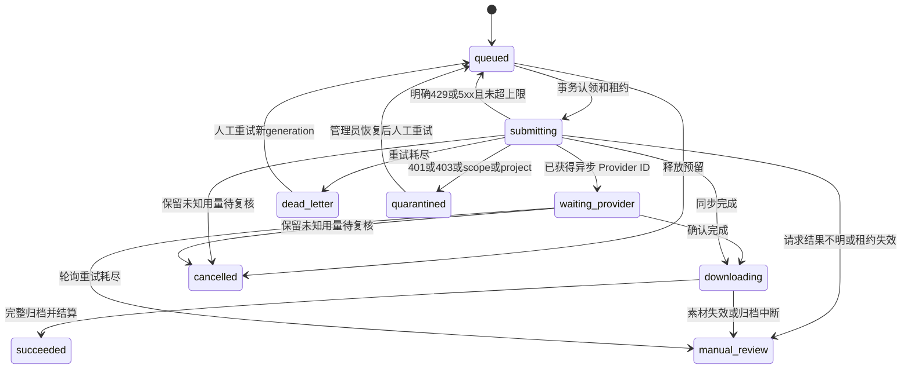

# 持久化 Generation Gateway

## 运行边界

`npm run gateway -- <config.json>` 启动 Node 24 独立服务。HTTP Gateway 和 `PersistentGenerationWorker` 共用 SQLite，页面关闭、刷新或 HTTP 断线不影响已提交任务。服务器适配器实现 `GenerationProviderAdapter`，支持正式 OpenAI-compatible / Gemini API 与本地 ComfyUI，每次供应商请求一个输出，批次按队列控制并发。

当前交付为可运行单机后端，未发布公网服务，未连接真实计费账户或执行付费供应商测试。首页、对话、画布图片及结果编辑共用 `submitImageCommand → executeTask`；随后按平台分为下列实际调用链，不能把一条链的验收推广到另一条。

- Web BYOK：`generateImages` 直接调用 OpenAI-compatible 图片接口并归档到 IndexedDB。
- Desktop BYOK：`submitNativeTask → task_host_submit` 由随 Tauri 打包的 Rust TaskHost 读取系统凭据库、请求 Provider、写原生素材仓库与 `tasks/native-host/` journal；UI 轮询 IPC，不回退浏览器 Provider。T5 实现已接入，但原生提交缺少连接 reservation/assertCurrent 与结构化失败 health 回写，不能沿用 Web 门禁已完成的结论；[当前缺口审计](../evidence/ai-sdlc-2026-09-20/desktop-provider-gap-audit.md)与隔离 Tauri/WebView 提交、取消和进程重启验收仍为 PARTIAL。
- 独立 Gateway：本页 Node SQLite Gateway/Worker 提供 `GenerationJobClient` 和 `/v1/jobs`；当前 UI 尚未接入，不代表正式平台账户或账单已上线。

产品任务保留可选 `sourceItemId`，结果通过 result edge 连回来源。三条链的任务/凭据/存储边界分别记录和验证；原生 TaskHost 现状见 `docs/changes/2026-09-19-taskhost-durable-intent/verification.md`。没有个人 ChatGPT Pro / Google AI Pro 登录共享、OAuth 会话轮换、跨账号限额绕过。

连接元数据的 `active` 表示已配置并可尝试提交；`verificationStatus` 与 `lastSuccessfulGenerationAt` 单独记录成功图片响应。保存配置和 `/models` 成功不生成验证记录；模型/地址/凭据改变清除旧验证并使旧请求无法回写验证，不清除 cooldown/quarantine。比例和清晰度目前仅保存为画布草稿参数，图片请求使用供应商默认参数。

## 数据库 schema

权威 schema：`src/features/generation-server/schema.sql`。Node 原生 SQLite 使用 WAL、FULL 同步、外键和 BEGIN IMMEDIATE 事务；Gateway 实际创建数据库，Tauri 不会隐式维护另一份账本。

| 表                                   | 用途与约束                                                                    |
| ------------------------------------ | ----------------------------------------------------------------------------- |
| generation_jobs                      | GenerationJob；owner + idempotency_key 唯一，规范化输入指纹防止同键不同请求   |
| generation_outputs                   | job + output_index 唯一；每项 generation、Provider ID、lease_token、asset_id  |
| job_attempts                         | JobAttempt；job + index + generation + number 唯一                            |
| credit_accounts                      | 管理员配置余额和并发；重启不会重置已消费余额                                  |
| credit_reservations                  | 每项、每次人工重试独立预留；held/manual_review 都占用可用额度                 |
| credit_settlements                   | reservation_id 唯一；actual_units、refunded_units 和复核状态                  |
| gateway_connections / connection_acl | 所有人、权限、状态、opaque credential_ref、单项价格、成本上限与已结算用量     |
| gateway_settings                     | platform_enabled 默认关闭，circuit_open 停止新提交                            |
| provider_request_logs                | ProviderRequestLog；内部标识、操作、状态码、分类、延迟，无 URL/body/headers   |
| webhook_deliveries                   | connection + delivery_key、connection + event_id 双重唯一；安全事件与处理状态 |
| stored_assets / asset_owners         | SHA-256、MIME、大小与所有者授权                                               |

任务输入只存 schema 允许的提示词、模型、隐私模式、附件和工作流。客户端不能指定 credentialRef、价格、ownerId 或供应商地址。

## 任务状态机

图示为单项状态，任务聚合为 queued/running/succeeded/partial/failed/dead_letter/quarantined/manual_review/cancelled。相同图片可共享 assetId，但成功数量与结算按输出槽位计数。

## Worker 恢复、取消与晚到结果

1. 先持久化任务及全部额度预留，再返回 202。Worker 不使用 HTTP 请求的取消信号。
2. 原子认领增加 lease_token，租约 120 秒，每 30 秒续约。重启仅恢复过期租约，不抢占其他 Worker 有效租约。
3. 已知异步 Provider ID 继续查询，不重新提交。同步请求已发送但响应未持久化时无法证明供应商未扣费，进入 manual_review，不盲目重发。
4. 归档中断、损坏或临时 URL 失效进入 manual_review。已经归档的对象不依赖供应商 URL。
5. 取消先提交终态及围栏，再尝试定向取消。ComfyUI 只删除指定队列项，不调用旧版全局 interrupt；运行中的供应商任务可能继续消耗资源。晚到结果无法新增资产授权、修改终态或重复结算。
6. 人工重试只能选择 failed/dead_letter/quarantined 项，重新验证授权并预留额度。新 generation 使用新幂等键，成功项保持资产与结算。manual_review 必须先由管理员核定用量。

## 连接选择与额度算法

采用用户明确指定 connectionId 的路由，不自动跨账户切换。服务端检查 connection_acl，BYOK/local 还必须属于当前用户。local_only 只允许 local ComfyUI；byok_local 要求本地 Gateway；platform_backed 只允许已经启用的 managed_api。

提交事务检查隐私模式、能力、固定模型、附件数、权限、连接状态、管理员停用、全局熔断、用户/连接并发和成本上限。

- 需要预留 = requestedOutputs × connection.unit_price
- 用户可用 = account.balance − SUM(held/manual_review reservation.units)
- 连接剩余预算 = cost_limit − spent − SUM(held/manual_review reservation.units)

两项剩余额度均足够才创建任务及各项预留。认领时再次检查实时并发、权限和管理员策略。全部连接冷却时等待持久化时间或拒绝新提交，不跨账号绕过冷却。

额度单位为管理员设置的每个成功归档输出的内部单价，不能视为供应商美元账单。成功项结算该单价；明确未执行失败释放预留；未知用量、素材失败或运行中取消保持预留待复核。管理员可核定 0 到预留上限范围的实际用量。真实 token/GPU/供应商货币账单对接仍需部署方提供计费集成。

## 错误分类

| 错误                                   | 处理                                                                     |
| -------------------------------------- | ------------------------------------------------------------------------ |
| 429                                    | 完整使用 Retry-After 秒数或 HTTP 日期；缺失为30秒、最小1秒，无15分钟截断 |
| 401/403/invalid_scope/project_disabled | 连接 quarantined，未提交队列项释放预留；管理员恢复后人工重试             |
| 明确5xx                                | 最多5次提交，500ms起指数退避，间隔上限60秒，最终 dead_letter             |
| submit 网络断开/超时/接受后响应异常    | manual_review，保留额度，禁止盲目重复提交                                |
| 已知ID的轮询网络/5xx                   | 保留ID和并发，有界重试耗尽后 manual_review                               |
| PNG损坏、MIME/大小不符、URL过期        | manual_review，不授予资产访问权                                          |
| 额度不足/策略关闭/权限失败             | 供应商调用前拒绝                                                         |

熔断、管理员禁用和 platform_backed 关闭阻止新的供应商提交；已经受理的任务继续获取并归档结果，避免主动制造 URL 过期。quarantined 和 Retry-After 仍限制供应商请求。

## Webhook

POST /v1/webhooks/:connectionId。X-KK-Timestamp 为秒时间戳；X-KK-Signature 为 HMAC-SHA256 十六进制；内容为 timestamp + '.' + rawBody，时间窗±5分钟。Idempotency-Key 为 delivery key。JSON 字段为 eventId、jobId、outputIndex、generation、providerJobId、idempotencyKey、sequence、status。

任务幂等键必须等于 jobId:index:generation，连接、输出代次和 Provider ID 必须匹配。同投递/事件不同摘要返回409；重复返回duplicate；较低sequence及终态事件记stale。早于Provider ID持久化的事件记pending，重启继续处理。事件只唤醒查询，不接受结果URL，不直接确认成功或结算。

## 密钥和资产

服务管理器或Vault将凭据注入服务进程内存；credentialEnv仅把opaque ref映射到环境变量名。启动时读入内存并从process.env删除；不读取.env，不提供浏览器供应商密钥录入接口，不保存明文密钥。桌面既有系统凭据库service为com.kkstudio.provider；本服务尚未自动读取该库，须由宿主resolver注入。refresh token与代理凭据不受支持。

对象存储为服务私有目录，目前仅接受PNG。校验声明MIME、流大小、PNG签名/块CRC、完整zlib数据与scanline，再以完整SHA-256命名、临时文件原子提交，支持的系统上权限0600。远程下载拒绝重定向，只允许管理员HTTPS origin allowlist，检查并固定公网DNS/IP；本地ComfyUI只允许注册loopback origin的/view。JPEG/WebP/GIF明确拒绝，不冒称完整性通过。

GET /v1/assets/:assetId每次检查用户与asset_owners，返回前重新核验摘要和大小；跨用户返回404。客户端仅获得assetId与自己的/v1/assets/...路由。应用会话token和供应商API Key分离；生产需要可信HTTPS反向代理及身份服务。

## HTTP与启动

- GET /health
- GET /v1/connections、GET/POST /v1/jobs
- GET /v1/jobs/:id、POST /v1/jobs/:id/cancel、POST /v1/jobs/:id/retry {indices}
- GET /v1/assets/:assetId
- 管理员 POST /v1/admin/controls：platformEnabled、circuitOpen、connectionId/state/credentialRef/costLimit、ownerId/accountDisabled
- 管理员 GET/POST /v1/admin/reviews、GET /v1/admin/logs

示例见config/generation-gateway.example.json。dataDirectory应放在Windows用户应用数据目录%APPDATA%/kk-studio/gateway，而非仓库。服务只监听127.0.0.1，不自动暴露公网。
