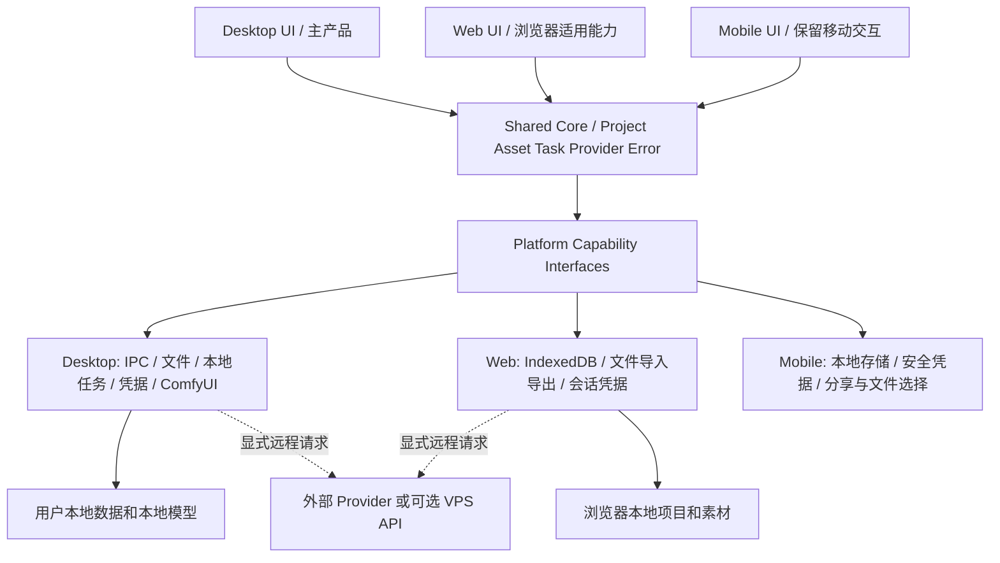
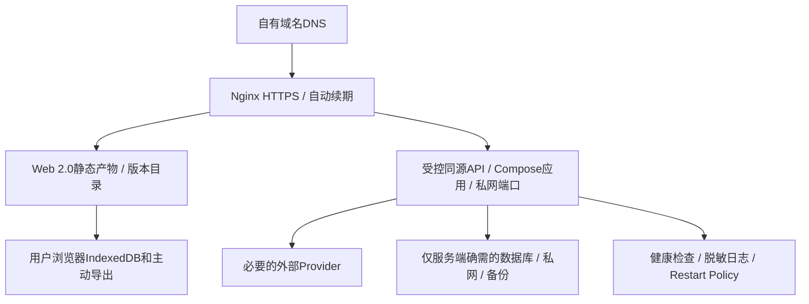

# KK Studio 2.0 Launch Readiness Audit

审计日期：2026-09-16。结论：**当前 2.0 有真实的图片请求、本地项目快照、素材归档和测试基础，值得在现有工程继续收口；尚不具备正式替换旧版的条件。首先修数据安全与核心工作流，再做 Web 和 VPS 切换。** 不使用“完成百分比”，因为 UI、适配器实现和真实端到端可用不是同一种完成度。

完整验证与实验证据见 [verification.md](verification.md)，任务依赖和验收见 [plan.md](plan.md)。所有本地源码引用针对本次当前工作区，而非仅 HEAD。

## 1. Current 2.0 State

### 必须分开的来源基线

| 来源 | 实际基线 | 本轮用途 |
| --- | --- | --- |
| 唯一活动工程 | `D:/kk-studio-next`；React 18 / TS / Vite / Tauri 2；package 2.0.0；master `609f5243e434494216a5e070b2bb2a4c4b7137dd` | 当前产品事实 |
| 工作区新增能力 | `App.tsx`、生成/任务/素材、Node Gateway 等大量修改和未跟踪文件；本地未配置 remote；另有 pnpm 锁文件，与 npm 唯一锁约束冲突 | 必须纳入审计，不能假设已提交、已推送或发布可重建 |
| 用户给出的 GitHub | 默认 main `931e205c2ca44c89754b9c67453bd7769467414b`；提交日期 2026-08-18；README / Mobile package 显示 1.6.1 monorepo | 有版本标识的旧产品 / Mobile 参考 |
| VPS 已部署服务 | `/opt/kk-studio/current/package.json` 显示 1.4.5；存在旧 `kk-api`、PostgreSQL、Web/Admin 静态文件 | 现存生产环境，不是 next 2.0 的部署证明 |

远程参考：[GitHub 固定提交](https://github.com/soudbs180-creator/kk-studio/tree/931e205c2ca44c89754b9c67453bd7769467414b)。本地不能直接用该远程 main 覆盖，也不能把本地 HEAD 当作 GitHub 当前版本。

**已经有实质实现：** 首页 / 项目库 / 画布 / 对话 / 设置 / 素材 / 任务工作台；真实 OpenAI-compatible HTTP 图片生成与编辑；参考图上传；批量结果分项归档；SHA-256 去重；项目草稿 / 消息 / 任务 / 卡片快照；Windows Credential Manager；错误、取消、离线和部分重试 UI；独立 SQLite Gateway/Worker、鉴权资产路由、幂等及 webhook 测试。

**仍未闭环：** 完整画布持久化、节点身份、读失败恢复、原生素材文件、项目包导入导出、供应商受理后的任务恢复、Provider 多协议统一入口、ComfyUI 主流程、真正的三端 capability 层、Web 本地数据迁移、独立 Mobile 2.0、可重复发布与生产部署。

**测试不是零基础：** 本轮 `npm run verify` 全通过，含 91 单元、130 浏览器测试、类型 / UI 115 文件 0 违规 / 格式 / build；`client:check` 与 Rust 6 单测通过。但图片浏览器测试使用 `page.route(...).fulfill(...)`，如 [creation-flow.spec.ts](D:/kk-studio-next/tests/browser/creation-flow.spec.ts:71)，尚不构成真实 Provider / GPU / ComfyUI 验收。

## 2. Product Architecture

产品方向固定为：Desktop 是主产品和完整能力载体，以本地项目、素材、任务与设置为权威；Web 复用成熟核心并裁去 ComfyUI / 原生能力，保留浏览器本地数据；Mobile 保留移动交互结构，接入同一核心契约，不复制桌面画布全部操作。

现状是单套 `App.tsx` 加少量 Tauri 边界：只有 `storage.ts` 与 `providerCredentials.ts` 各自重复环境判断；`src/runtime/storage-contract.ts` 主要是常量，尚没有统一 Platform Capability / 文件 / TaskHost 接口。不能说“到处都是 if desktop”，真实问题是 **平台契约还不完整，很多 Desktop 能力仍沿用浏览器实现**。

## 3. Desktop Core User Flow

当前真实入口：`src/main.tsx → App.tsx`。不是 URL router；`active` 切换 landing/workspace/projects/skills/comfyui，`modal` 管设置、素材、任务等，URL 仍为 `/`。[App.tsx](D:/kk-studio-next/src/App.tsx:1353)

| 步骤 | 当前调用链 | 判定 |
| --- | --- | --- |
| 打开 Desktop | Tauri `frontendDist=../dist` → main → App → StartPage | 可启动；已读取 `tauri.localhost` release 标识 |
| 新建 / 重开项目 | 项目库 `handleNewBlankProject` / `createProject` / activeProjectId | 有真实本地项目；侧栏 KK项目/KK工作流不是动态项目列表 |
| 导入图片 | input/FileReader → `readReferenceImages` / `useAssetImport` → `storeGeneratedAsset` | 实现可用，但所有平台的素材档案仍在 IndexedDB |
| 配置 Provider | ModelProviderSettings → 元数据 localStorage；credential_set/get → Windows 凭据库 | 实现真实；尚未做本轮真实供应商接入验收 |
| 首页 / 对话提交 | App.executeTask → generateImages → `/images/generations` 或 `/images/edits` | 真 HTTP 路径，仅 OpenAI-compatible 直连图片 |
| 从画布卡片继续生成 | CreationComposer → useLocalGeneration → 固定 fixture | **断点：是 demo，不走上面的真实任务链** |
| 选择 ComfyUI / 仅本地 | 工作流目录 + 设置占位；handleCreateProject 拒绝 local_only | **断点：没有端到端工作流** |
| 查看与控制任务 | taskControllers / AbortController + CreationTask.outputs + TaskWorkbench | 同进程真实状态；不代表远端受理后可取消或恢复 |
| 获取 / 保存结果 | Provider response → 下载 → hash → IndexedDB Blob + data URL → 项目卡片 | 有归档与单资源下载；缺原生文件档案与项目包 |
| 关闭后再开 | Tauri creation-v2.json / .bak → normalize → interrupted | 保留部分内容；布局、连线、视口不在项目契约；未完成任务只标中断 |

目标主流程是“创建/打开本地项目 → 导入素材 → 选已验证 Provider 或 Desktop ComfyUI → 创建持久任务 → 执行/失败/取消/未知受理 → 结果落本地 → 继续编辑 → 关闭 → 项目、图结构、素材引用和任务状态恢复”。“再次打开”必须验收真实进程退出，不能只看刷新测试。

## 4. Web Core User Flow

目前 Web 和 Desktop 共用 App。项目保存在 IndexedDB `kk-studio-next/creation/snapshot`，localStorage `kk-studio-next:creation:v1` 是小于 4,000,000 字符的恢复副本；素材在 `kk-studio-assets/blobs`；设置、Provider 元数据、连接、集合分别持久化；API Key 只在会话内存。[storage.ts](D:/kk-studio-next/src/features/creation/storage.ts:10)、[assetRepository.ts](D:/kk-studio-next/src/features/creation/assetRepository.ts:44)、[providerCredentials.ts](D:/kk-studio-next/src/features/creation/providerCredentials.ts:3)

目标：HTTPS 打开 Web → 创建/导入本地项目 → 导入素材 → 选 Web 支持的 Provider → 显式远程提交 → 结果归档到本地 → 下载/项目包备份 → 重开恢复。重启后重新输入 BYOK 密钥是当前会话凭据策略，不应误判为密钥持久化 bug。

发现的边界问题是 Web 仍展示 ComfyUI 导航、工作流目录和 local_only 选项。没有证据证明普通 Web 在当前主流程中实际调用 ComfyUI IPC；已见的两处 IPC 边界有环境防护。应同时治理菜单和能力调用边界，而不只隐藏一个按钮。

Web 基础方案继续以 IndexedDB 为主；文件选择/保存 API 只作检测后启用的增强，提供标准 file input + download fallback。增加存储容量、持久存储申请、错误提示、版本化项目包、明确的离线打开策略。浏览器存储通常以 origin 分隔且默认 best-effort，不能当作永久外部备份；更换域名不自动带走旧 origin 数据。[MDN 存储机制](https://developer.mozilla.org/en-US/docs/Web/API/Storage_API/Storage_quotas_and_eviction_criteria)、[File System API](https://developer.mozilla.org/en-US/docs/Web/API/File_System_API)

## 5. Mobile Strategy

**next 活动工程没有独立 Mobile App、Mobile Store 或移动业务路由。** 当前 390px 测试验证的是同一个 App 的布局；不能据此宣布 Mobile 2.0 完成，也不能断言 next Mobile 正在使用旧 Store。

旧 GitHub 存在两条不同参考：

| 参考 | 值得保留的内容 | 必须替换的内部依赖 |
| --- | --- | --- |
| `apps/web/src/components/mobile/MobileAppShell.tsx` | Header / feed / composer 分区、safe-area 和覆盖层结构 | 绑定 2.0 的状态 / capability，不能用宽度推导 Desktop 权限 |
| `MobileTabBar.tsx` | 创作、画布、Copilot、资源的底部导航手感；具体入口按 MUR 裁剪 | 旧 GenerationMode / MobilePrimaryTab / 旧业务枚举 |
| `MobileMoreMenu.tsx` | 底部 Sheet、遮罩关闭、设置入口 | 当前平台可用入口和权限 |
| `MobileResultFeed.tsx` / `MobileResultDetailScreen.tsx` | 卡片结果流、详情返回、预览、引用、下载 | GeneratedImage / Canvas / RedrawRequest / 电商 continuation / 旧 task events |
| `SettingsMobileDashboard.tsx` / `mobileSettingsNavigation.ts` | 设置总览、分组与二级返回 | BillingContext、keyManager、costService、旧 browserBridge、server-first 选项 |
| `apps/mobile` Expo 1.6.1 | SafeArea / Stack / 返回路径、安全凭据与鉴权错误经验 | 旧 Zustand Auth、旧服务地址与权限；`canvas.tsx` 的 mockNodes、settings 静态 Production 文案、skills 本地数组都不能继承成服务事实 |

以上是固定提交的源码参考，不是本轮手机设备视觉验收。[旧 Mobile UI 目录](https://github.com/soudbs180-creator/kk-studio/tree/931e205c2ca44c89754b9c67453bd7769467414b/apps/web/src/components/mobile)、[旧设置入口](https://github.com/soudbs180-creator/kk-studio/blob/931e205c2ca44c89754b9c67453bd7769467414b/apps/web/src/components/settings/SettingsMobileDashboard.tsx)、[Expo mock 页面](https://github.com/soudbs180-creator/kk-studio/blob/931e205c2ca44c89754b9c67453bd7769467414b/apps/mobile/src/app/canvas.tsx)

Mobile 正式适配排在 Desktop MUR、Shared Core、Web VPS 替换之后。届时优先“项目列表 → 结果查看 → 任务状态/适当控制 → 基础参数 → 必要设置”，不重做整个移动视觉，也不承诺读取另一台 Desktop 的本地文件。跨设备任务控制需要额外的、明确授权的连接方案，当前不默认增加云同步。

## 6. Capability Map

表中测试表示当前已有覆盖，不代表真实外部服务验收；Mobile 一列指 next 的独立移动产品。

| 模块 | Desktop UI | Desktop Logic | Web | Mobile | Persistence | Error Handling | Test | 状态 |
| --- | --- | --- | --- | --- | --- | --- | --- | --- |
| 页面 / 菜单 / 画布基础操作 | 已有 | 交互真实 | 同 App | Missing | 部分偏好 | Escape/焦点/取消已有 | 浏览器 | Almost Ready，仅界面基础 |
| 本地项目创建/打开 | 已有 | 本地快照 | IDB 同流程 | Missing | 单一全局快照 | 有保存提示，读失败危险 | 浏览器/领域 | Partial |
| 画布坐标/连线/视口恢复 | 已有 | 仅组件 state | 同缺陷 | N/A | 缺少契约字段 | 未检测丢失 | 本轮复现 | Broken |
| 节点身份 | 已有 | 组件内递增 ID | 同缺陷 | N/A | 已有节点可与新 ID 重复 | 未防冲突 | 本轮复现 | Broken |
| 原生项目包 / 打开文件 / 备份恢复 | 菜单不完整 | 无完整服务 | 无完整导入导出 | Missing | .bak 仅内部快照 | 无可审阅恢复选择 | 缺闭环 | Missing |
| 素材导入/去重/集合/Provenance | 已有 | IDB Blob + SHA | 已有 | Missing | 两端依赖浏览器档案 | 部分失败会被泛化 | 单元/浏览器 | Partial |
| Desktop 原生素材文件档案 | UI 无独立映射 | 未接 IPC 文件库 | N/A | N/A | assets 目录仅创建 | 缺恢复策略 | 缺 | Missing |
| Provider 设置/凭据 | 已有 | Windows vault + 元数据 | 内存 key + 元数据 | Missing | 双存储边界 | 连接测试真实；可用标签不严谨 | 模拟接口 | Partial |
| 首页/对话图片生成 | 已有 | OpenAI-compatible fetch | CORS 条件下同路径 | Missing | 任务/结果有快照 | HTTP/离线/超时已有 | fixture E2E | Partial |
| 画布图片/视频/音频/文案生成 | 已有 | useLocalGeneration fixture | 同 demo | Missing | 卡片部分持久 | demo 的取消/失败 | 浏览器 | Mock / Prototype |
| 批量任务/审批/局部重试 | 已有 | App 内存调度 | 同实现 | Missing | 输出和状态快照 | 接收未知未闭环 | 单元/浏览器 | Partial |
| 持久 Worker/Gateway | 无主界面接线 | 独立 Node SQLite 服务 | 未接产品 | Missing | jobs/events/ledger/assets | 重启/未知/围栏有覆盖 | Node 故障矩阵 | Partial，基础设施实现 |
| ComfyUI / 模型扫描 | 目录和设置 | Rust 命令+HTTP Adapter，无 UI 主流程 | 错误地暴露入口 | N/A | 工作流/模型索引未闭环 | local_only 明确拒绝 | 部分适配器测试 | Prototype / Desktop Only |
| 设置主题/浮岛 | 已有 | 可生效 | 可生效 | Missing | localStorage | 存储失败可见 | 浏览器 | Almost Ready，限定这些偏好 |
| 自启动/托盘/防休眠 | 禁用 | 未接 | N/A | N/A | N/A | 原因文案仍泛称浏览器 | 界面 | UI Only / Desktop Only |
| Agent / Review / 评论转任务 | 已有 | 评论/审批/提示词规则真实 | 同 | Missing | 项目 reviewComments | 有边界提示 | 浏览器 | Partial；非完整自主 Agent |
| Skill/MCP/Memory/账户/积分/分享 | 目录/占位 | 未接服务 | 同 | Missing | 不应冒充真实服务 | 多数禁用或 Prototype | 界面 | Prototype / UI Only |
| 语音输入 | 已有 | Web Speech API | 取决于浏览器 | Missing | 不存音频 | 权限/网络/不支持提示 | mock Speech API | Partial；非离线语音 |
| Web 生产部署 | 本地包 | N/A | 无 next VPS 发布 | N/A | 无发布 manifest/回滚链 | 现有旧服务独立 | 本轮网络检查 | Missing |

## 7. Platform Capability Matrix / Ownership

下表 Desktop/Web/Mobile 是**目标能力边界**，当前状态在单独列中；Full 不表示现在已完成。

| Feature | Desktop | Web | Mobile | Primary Platform | 当前状态 | MUR / 目标 |
| --- | --- | --- | --- | --- | --- | --- |
| 项目生命周期和 schema | Full | 浏览器本地 Full | 轻量查看/管理 | Shared，Desktop 先落地 | Partial | MUR：创建/打开/保存/恢复/导出 |
| 画布编辑/连接 | Full | 核心适用子集 | 结果流/轻量选择 | Desktop | 恢复 Broken | MUR：可恢复核心图结构 |
| 素材/结果/来源 | 原生文件与索引 | IDB Blob与导出 | 查看/导入/系统分享 | Shared | Partial | MUR：原图可读、引用完整 |
| Provider 契约 | 所需协议 | 已审核浏览器协议 | Selected | Shared | 主入口只有图片兼容协议 | MUR：一条真实图片协议先通 |
| 凭据 | OS vault / 请求内存 | 当前会话内存 | 平台安全存储/会话 | 平台独立 | Windows 实现 | 不强制云账号 |
| 图片生成/编辑 | Full | 浏览器适用 | 基础任务 | Shared，Desktop 主流程 | Partial；画布还是 demo | MUR：同一任务入口 |
| Task lifecycle | 本地持久执行宿主 | 本地任务记录；显式远程任务可选 | 已授权状态查看/控制 | Shared 契约 / Desktop 宿主 | App 与 Worker 分离 | MUR：未知受理可识别，不盲重发 |
| ComfyUI | 本地 workflow/任务/产物 | N/A | N/A | Desktop | 未闭环 | Desktop 阶段只接一条验证 workflow |
| 本地模型/目录扫描 | Full | N/A | N/A | Desktop | Rust scan 未接 UI | 与最小 ComfyUI 链一起验收 |
| 原生打开/另存/恢复 | Full | 浏览器导入/下载替代 | 系统选择/分享 | Desktop | Missing | MUR：项目包与结果保存 |
| 重型编排/大批量 | Full | 受限 | N/A | Desktop | 高级 Prototype | 大规模功能 Backlog |
| 通用设置 | Full | Web relevant | Mobile relevant | Shared schema | 部分真实 | MUR：保留有效设置 |
| 系统托盘/自启动/休眠 | 可选 | N/A | N/A | Desktop | 禁用 | 非首个 MUR 阻断项 |
| Skill/MCP/Agent 自动编排 | Full，后续 | 按需裁剪 | 轻量入口 | Desktop / Shared 契约 | Prototype | Backlog，不扩成前置条件 |
| 账户/账单/平台额度 | 可选外部能力 | 可选外部能力 | 可选 | Shared 服务 | UI未接独立账本 | Backlog，Local First 不依赖它 |
| 云盘/云项目/自动跨端同步 | 不默认提供 | 不默认提供 | 不默认提供 | 无默认 owner | 未接 | 不进入 MUR |
| Web Hosting / API / Secrets | 可选联网服务 | VPS | 使用必要 API | Web/Server | VPS是旧部署 | Web MUR后 VPS单生产 |

## 8. Shared Core

可继续使用的基础包括 `domain/settings.ts`、`domain/modelProvider.ts`、`domain/providerConnections.ts`、`domain/canvasGraph.ts`、`domain/reviewWorkflow.ts`、`domain/agentWorkflow.ts`、`features/creation/model.ts` 的项目任务类型、`generationQueue.ts` 的部分规则、`promptCompiler.ts`、Provider Adapter 契约、`styles/ui-tokens.css` 与基础控件。

需要逐步改造的内容：

1. Project 模型加入坐标、连接、视口、参数、资源引用、版本/修订校验；不要把 base64 原图继续复制在大量快照字段中。
2. 将 App 的 project service、task state machine、provider route binding、恢复策略抽为可独立测试的服务。App 已约 1,690 行，不应继续集中新增业务。
3. 将 `model.ts` / `providerRegistry.ts` 中的 window/localStorage 读写移到适配层；共享层用数据参数和接口，不读浏览器全局对象。
4. 统一 Provider interface 与真实入口，避免 `imageGeneration.ts`、未消费的 factory、服务端 Host Adapter 长期分裂为三套产品协议。
5. 统一错误模型：输入错误/鉴权/限流/网络/磁盘/完整性/受理未知/用户取消/仅平台不支持，保留用户可执行恢复动作。
6. 共用语义 tokens、schema、校验、业务规则；移动 UI 的布局与组件不要求逐行复用 React DOM。

顺序是修 Desktop 所需的小接口，再完成 Desktop MUR，最后系统清理 Shared Core；不以一次大重构阻塞恢复缺陷修复。

## 9. Platform Specific Layer

建议建立小而明确的接口，先服务当前 MUR：

| 接口 | Desktop Adapter | Web Adapter | Mobile 以后 |
| --- | --- | --- | --- |
| PlatformCapabilities | tauri bootstrap 提供原生能力 | browser bootstrap 明确 comfyui=false/nativeModels=false | 单独移动 capabilities |
| ProjectRepository | 原生本地 schema、事务/备份/恢复 | IndexedDB 事务与 revision 冲突保护 | 移动本地仓库 |
| AssetRepository | 本地文件/内容 hash/索引/可恢复路径 | IDB Blob / 按 assetId 读取 / 导出 | 本地文件与缩略图 |
| FileAccess | 系统 picker、原生路径、原子写、另存 | file input / download；FSA 可选 | 系统 picker/share |
| CredentialStore | Windows vault；其他 OS 实现需单独验收 | request/session memory | Keychain/Keystore 等能力 |
| TaskHost | 持久本地任务，不绑定 WebView 生命周期 | 当前页任务 + 恢复日志；服务器任务仅显式选择 | 后台限制下的选定任务 |
| ComfyUIHost | 本地连接/模板/模型/队列/history/output | 无实现，不注入 | 无实现，不注入 |
| ProviderTransport | 原生 HTTP / 本地宿主，解决真实桌面请求边界 | 浏览器 CORS 直连或明确同意的同源代理 | 按平台传输 |

现有 Rust 中 scan、chat、comfy commands 不等于 UI 已使用；搜索前端未发现这些命令的业务调用。原生图片请求也尚未利用这些 reqwest 命令。Tauri 的 value 在项目快照与 vault 已存在，但文件、任务和 ComfyUI 尚未发挥完整平台能力。

## 10. Launch Blockers

优先级 P0：数据/身份可靠性或生产发布阻断；P1：核心功能闭环；P2：整理/扩展。这里是审计优先级，不表示本轮已修改。

| ID | 级别 | 已确认问题与影响 | 证据 | 关闭条件 |
| --- | --- | --- | --- | --- |
| LB-01 | P0 | 读取项目失败后 catch 仍使 storageReady=true；“重试保存”直接写当前空快照。Rust writer 会删除旧 .bak 并轮换文件，可能破坏可恢复副本 | App 254/274/390；Rust 474；故障注入 `projects:0, revision:0` | 读失败进入恢复/只读状态；重试读取不写空数据；损坏原件不可被默认覆盖 |
| LB-02 | P0 | 项目没有坐标/连接/视口；刷新 image.left 从146回82，新增卡位置也回默认 | model 92；useCanvasControls 44；useCanvasConnections 21；browser-audit JSON | 切项目、刷新、真实重启完整还原图；引用完整性校验 |
| LB-03 | P0 | nextNode useRef(1)，重新挂载后与持久化 `added-image-1` 冲突 | useCanvasNodeActions 49；开发及生产预览均复现重复 ID | UUID/稳定唯一 ID；旧冲突检测；跨项目与重启不重复 |
| LB-04 | P0 | 素材接受100MB，但 normalize 将 preview/result.src 截到16MiB字符，data URL可被截坏；快照重复包含大图 | assetRepository 46/263；model 388/424；合约实验证明长度被截 | assetId引用独立原图；大小策略一致；超限明确拒绝，不静默截断 |
| LB-05 | P1 | 正式执行仍绑定 React/AbortController；受理未知/暂停/关闭后没有 providerJobId 对账，retry换新幂等键 | App 82/565/931；imageGeneration 179；Gateway client 无调用方 | durable task日志；未知受理单独状态；不盲重发；恢复不重复生成 |
| LB-06 | P1 | 首页/对话可请求图片，画布生成/结果继续编辑仍固定demo；workflow不闭合 | CreationComposer 68；useLocalGeneration 54；CanvasNodeContent | 选定 MUR 图片操作全部接同一 Task service；demo单独标记 |
| LB-07 | P1 | ComfyUI入口存在，但local_only被拒绝，扫描/模板/历史/产物归档没有接到用户路径 | App 987；Rust 829/845/872/919；factory无消费 | Desktop上一条已验证工作流完整执行和重启恢复；Web/Mobile无入口 |
| LB-08 | P1 | Provider原生Gemini等适配器没有进入App；未测试元数据登记即state active/可用；expired cooldown仍不可调度，UI还可能通过续写/重试绕开统一健康判断 | providerRegistry 177/199；ProviderConnectionList 49；generationQueue；contract-findings | verified状态与可配置分离；真实协议校验；每次调度同一健康/配额规则 |
| LB-09 | P1 | Desktop素材、设置、连接仍依赖WebView存储；缺项目包/原生另存/恢复及用户可见数据位置 | assetRepository；SettingsPanel；TopBar；storage_paths只建assets目录 | 原生数据/文件边界、备份/导出/导入恢复验收 |
| LB-10 | P1 | Web ComfyUI入口、only-local选项未裁剪；没有统一capabilities | Sidebar 14；LibraryPage；App987；本轮Web截图 | 编译/注入与UI同时限制Desktop only能力 |
| LB-11 | P0 for Web launch | VPS公网5432、3001、4174可达；旧服务与目标域名/新2.0部署未隔离；payment上游缺失返回502 | 只读SSH + 外部TCP/HTTP | 上线前收口暴露、隔离staging、健康/备份/回滚验证；不以旧服务health代替2.0健康 |
| LB-12 | P0 for release | 本地、GitHub、VPS版本不同；关键实现未提交；无next部署配置/CI；README部分持久化说明陈旧 | git/package/README/部署元数据 | 固定候选提交、单一npm锁、构建与迁移manifest、安装包与回滚产物可重建 |

LB-01 的“空写”是独立浏览器会话中模拟 IPC 读取失败后观察到的调用，不是拿用户真实项目做破坏性试验。LB-02/03 在开发 1421 与生产预览 1423 两种产物复现。LB-04 的测试字符串用于长度合约验证，不声称做过100MB真实图像渲染测试。

其他应随闭环修复的点：侧栏项目名/删除/置顶仅组件 state；通用设置“去水印”只存偏好；无参数到Provider的完整映射；Gateway Node进程尚未有Tauri打包/启动/关闭生命周期；浏览器多窗口写入没有 revision CAS；项目+素材跨存储提交不是统一事务；JSON .bak 当前没有 fsync/完整 schema 校验/多代恢复证明。均不能用目前全绿测试代替验收。

## 11. Minimum Usable Release

拆成两个正式门禁：**D-MUR（先交付 Windows Desktop）**、**W-MUR + VPS（才可替换旧 Web）**。Mobile不作为前两者的阻断条件。

### D-MUR

- 不依赖VPS或账号即可打开应用、创建/打开本地项目、导入素材、编辑和保存。
- Project包含稳定ID、节点位置/连线/视口、素材引用、任务记录、必要参数和revision；切项目、退出重开一致。
- 项目与原始素材可导出为版本化包；校验后导入；损坏/磁盘满/权限失败不覆盖可恢复原件。
- 至少一条明确支持的真实图片Provider链：文生图、一个参考图编辑、结果保存/预览/下载/继续编辑；模型来自验证或明确配置，不用kk-image示例名冒充线上可用。
- 任务覆盖提交前、已受理、运行中、部分成功、成功、失败、取消请求/已取消、离线、受理未知与重启恢复；已受理未知不自动或普通重试新提交。
- 本地执行宿主与UI生命周期分离，或在首个受限版本明确关闭前等待/确认退出，并保留可恢复的未知受理记录；不能宣称后台续跑而只有React promise。
- ComfyUI按用户确定的核心方向进入Desktop闭环队列：先接一个用户选择安装位置、已验证模型和workflow的图像任务，不要求完整工作流编辑器。若将ComfyUI从首个发布范围延后，必须明确把首包命名为“BYOK图片基础版”，保持ComfyUI禁用，不能宣称Pure Local生成已完成。
- 设置真实生效；Windows凭据不入项目/导出/日志。托盘、自动更新、MCP、账户、云服务不作为此首包前置条件。
- 在干净安装环境验证包：不依赖开发机node_modules、开发Vite或外部系统Node；打包sidecar时必须验证其携带、权限和退出行为。

### W-MUR

同一核心模型和任务语义，Browser Storage可恢复；无ComfyUI/本地模型/原生API假入口；支持选定浏览器的真实Provider流程及明确跨域失败；项目包备份和旧origin导出通道完成；HTTPS自有域名/VPS staging与production通过；API/资产鉴权、健康检查、重启、日志、容量和回滚演练通过。

本次未使用真实生成Provider密钥，未发起付费生成，未运行真实ComfyUI模型，故 D-MUR 与 W-MUR 均未达标。

## 12. MVP Gap

最少需要补的不是更多页面，而是：安全恢复 → 完整项目图与唯一ID → 独立素材仓库/项目包 → 统一图片任务入口 → 本地持久任务语义 → 一条真实Provider与最小ComfyUI验收 → Desktop包装交付。之后才是共享层整理、Web裁剪/本地数据、VPS生产与切换。

可后置：视频/音频全链、Agent自动编排、Skill商店、MCP、平台额度/账单、账户体系、云盘/云同步、公开分享、重型批量与完整ComfyUI编辑器、旧版所有高级业务。C2PA/SynthID只呈现供应商实际返回的证据，不加入伪检测。

## 13. Recommended Implementation Order

严格依赖链：

`T0 固定发布基线 → T1 读失败保护 → T2 图结构/ID → T3 本地素材/项目包 → T4 Provider统一接线 → T5 TaskHost/未知受理 → T6 最小ComfyUI → T7 Desktop真实验收与打包 → T8 Shared Core整理 → T9 Web本地版 → T10 VPS staging/production → T11 旧Web退役 → T12 Mobile适配 → Backlog`。

VPS暴露面收口可作为单独基础设施变更提前准备，但本轮没有执行变更；不得借此把Desktop依赖迁往服务器。每项详细目标、文件、风险、前置与通过条件见 [plan.md](plan.md)。

## 14. Legacy References

| 旧能力 | 当时解决的问题 | 2.0仍需要 | 路线符合 | 当前处理 | 后续建议 |
| --- | --- | --- | --- | --- | --- |
| 移动底部导航/Sheet/结果详情 | 单手操作与低信息密度 | 是 | 是 | Still Relevant | 保留交互，替换输入数据和事件契约 |
| 项目完整图/修订/校验/备份思路 | 重启恢复和数据安全 | 是 | 是 | Still Relevant | 参考归档projectGraph与repository的验收场景，按2.0重建 |
| 旧Platform/StorageAdapter思想 | 隔离原生和浏览器 | 是 | 是 | Still Relevant | 建最小接口，不复制旧实现 |
| 旧Provider恢复/取消/幂等经验 | 避免丢任务和重复提交 | 是 | 是 | Still Relevant | 参考故障场景；复用当前新Worker已有算法 |
| 旧ComfyUI模型发现/模板思路 | 本地执行 | 是 | Desktop Only | Redesign Later | 接新Task/Asset模型，只验证首条模板 |
| 旧自主Agent/品牌/电商/演示稿 | 高级场景 | 部分 | 需按功能五问 | Optional | Backlog，不作旧版对等清单 |
| 旧积分/云存储/全局server-first | 商业/云服务默认 | 首个MUR否 | 与本地优先有冲突 | Do Not Rebuild as prerequisite | 以后有明确需求再设计 |
| 旧Vercel Functions/双生产链 | 旧部署平台需要 | 否 | 否 | Do Not Rebuild | 仅有限回滚窗口后退役 |
| 旧Store/API/ProjectSchema直接复制 | 保持旧技术连续性 | 否 | 否 | Obsolete for new core | 不直接继承；需要数据导入时单独schema+checksum+用户操作 |

本地历史只读参考：`D:/KK-Studio-legacy-archive-20260909/src/core/contracts/projectGraph.ts`、`src/platform/desktop/DesktopAdapter.ts`、`src/platform/web/WebAdapter.ts`、`src/core/storage/StorageAdapter.ts`。没有运行或恢复旧工程，没有导入用户备份数据。

## 15. VPS Connectivity

本轮成功以SSH系统账户执行只读审计；不是把管理面板登录误当SSH。`nerdvm.racknerd.com` 是主机控制面板登录页，不能当作KK Studio域名。提供的API Key/Hash未使用：当前next源码没有其服务契约、用途或权限范围证明；有SSH后也没有额外调用主机管理API的必要。

| 检查 | 实测 |
| --- | --- |
| TCP 22 / 80 / 443 | open |
| SSH | OpenSSH 10.0p2 Debian banner；认证与只读命令成功 |
| HTTP IP `/` | 301到HTTPS同IP |
| HTTPS裸IP | 证书名称不匹配；不能据此说所有HTTPS坏了 |
| HTTPS `172-245-156-16.sslip.io/healthz` | 200，旧kk-studio-api的health |
| 同域名 `/` | 404（当前TLS vhost主要代理旧API，不是2.0静态站） |
| 同域名 `/payment/` | 502；配置上游127.0.0.1:8080，当前未监听 |
| 外网3001 / 4174 / 5432 | TCP open；3001 health 200；4174管理静态页200 |
| 3389 / 8188 / 8443 / 4318 | 探测时拒绝；8080先超时后拒绝 |
| ICMP | 未做ICMP结论；TCP+SSH+HTTPS已直接验证所需可达性 |

## 16. VPS Readiness

| 项目 | 只读实测 |
| --- | --- |
| OS / Kernel | Debian GNU/Linux 13.1；6.12.43+deb13-amd64 |
| CPU | 1 vCPU，Xeon E5-2690 v2，KVM |
| RAM / Swap | 967MiB RAM，检查时665MiB available；1GiB swap，约45MiB已用 |
| Disk | 根ext4约24G，使用4.8G，可用19G；inode约6% |
| Node / npm / pnpm | v24.14.1 / 11.11.0 / 12.4.2；新工程仍坚持npm锁 |
| Nginx | 1.26.3，running |
| Docker / Compose / PM2 / Caddy | 未发现可执行文件/运行服务；不等于已准备好Compose部署 |
| systemd | kk-api、nginx、PostgreSQL17 running；failed units=0；kk-api以kkstudio用户运行、Restart=always |
| 数据库 | PostgreSQL17，0.0.0.0和IPv6监听5432；已证实外部可达，不做未授权读写或漏洞利用 |
| 防火墙 | nft命令存在，读取ruleset没有规则输出；ufw/iptables/firewall-cmd未发现；未核查托管商外部规则配置 |
| SSH策略 | root密码登录启用，公钥登录启用；7天error级日志中ssh.service 427条，未据此断言入侵 |
| TLS | Let's Encrypt，CN=172-245-156-16.sslip.io，有效期2026-09-06至2026-12-05；certbot.timer存在 |
| Logs | Nginx当前access.log样本1656行，200=14、301=330、404=1099、400=211、401=1、502=1；kk-api指定7天journal没有记录，不能据此声称无错误 |
| 备份 | 未发现应用/数据库备份timer的证明；dpkg-db-backup只备份包管理数据库，不是业务DB备份 |
| 现有网站 | /var/www/kk-app、/var/www/kk-admin；旧bundle；部分server_name还是app/api/admin.example.com占位 |

判断：**适合作为小规模Web静态站+轻量API的候选宿主，尚不能标为2.0生产就绪。** 这是基于当前资源与服务占用的工程判断，不是性能压测结论。无需在此运行ComfyUI、GPU模型或媒体重型处理。1GB内存且已有PostgreSQL，应在CI/开发构建产物、VPS只运行；是否扩容由真实RSS、并发和任务压测决定，不能许诺容量。

## 17. VPS Production Architecture

建议延续已存在且能工作的Nginx和certbot，应用层在staging验证Docker Compose后采用同一生产链；不同时再引入Caddy争用80/443。若后续决定全栈Compose + Caddy，视为单独网关迁移并预演，不能首连替换。

服务端Secret通过部署Secret注入请求/进程内存，不写Web构建变量。用户项目和素材默认仍在浏览器；只有明确的生成请求或用户动作传输对应输入。新Gateway当前有SQLite与独立账本，不因VPS已有PostgreSQL就强行重写Desktop存储，也不把旧1.4.5 API schema直接作为新Core。

实施前需：独立next版本目录与服务名、staging域名、健康/ready、只允许必要公网端口、限额与日志轮转、资源约束、服务/数据备份恢复、只读静态资源、打包版本和回滚操作单。先测现有Node服务内存，再决定Compose资源限制与数据库沿用范围。本轮未安装Docker、未重启服务、未修改任何生产配置。

## 18. Domain Deployment Plan

正式自有域名尚未提供；控制面板域名与sslip测试域名都不代表最终域名。因此本轮不改DNS。

1. 确定正式与staging hostname、DNS管理方；记录当前旧域名指向和TTL，先导出旧origin本地数据。
2. Staging A记录指向172.245.156.16；仅在VPS确有IPv6服务与证书路径时设置AAAA，否则检查并处理旧AAAA。
3. 配置独立Nginx vhost和TLS，HTTP跳转HTTPS；静态SPA路由回退到index，API路由独立且同源，旧服务不覆盖。
4. 验证首开/深链/刷新/缓存更新/项目重开、真实Provider、素材下载、CORS/鉴权、容量错误、离线行为、服务重启与回滚。
5. 发布固定版本产物；业务数据升级可回退或有版本备份；记录旧/新bundle指纹。
6. 到达W-MUR才切正式域名；监控健康、错误率、磁盘/内存与失败任务。DNS回滚只回入口，不自动回滚新schema或恢复浏览器数据。

## 19. Legacy Web Retirement Plan

Vercel以后仅属于Legacy Deployment，不新增Functions、不维持长期双生产。退役条件依次为：

`Desktop MUR → Shared Core稳定 → Web MUR → VPS Staging验证 → 自有域名生产切换 → 有期限的Rollback Window → 停止旧Web/Vercel → Mobile 2.0 → 扩展`。

建议切换前写明回滚窗口（例如7天，最终以实际使用频率/业务验证决定），期间旧部署仅作为回滚候选，不接受新功能开发。关闭旧服务前必须验证旧用户数据可导出/必要导入、目标schema不依赖旧API、真实新任务和结果可恢复、域名/证书/监控/备份正常、没有仍调用旧Functions的请求。停止Vercel、删除旧资源和移除旧数据库是后续独立执行步骤，不是本轮审计动作。

**下一开发单元应从T1/T2开始：保护项目原件，保存完整画布并消除节点ID冲突。** 当前继续增加新Provider、页面或高级Agent，会扩大已有恢复与任务语义问题。
