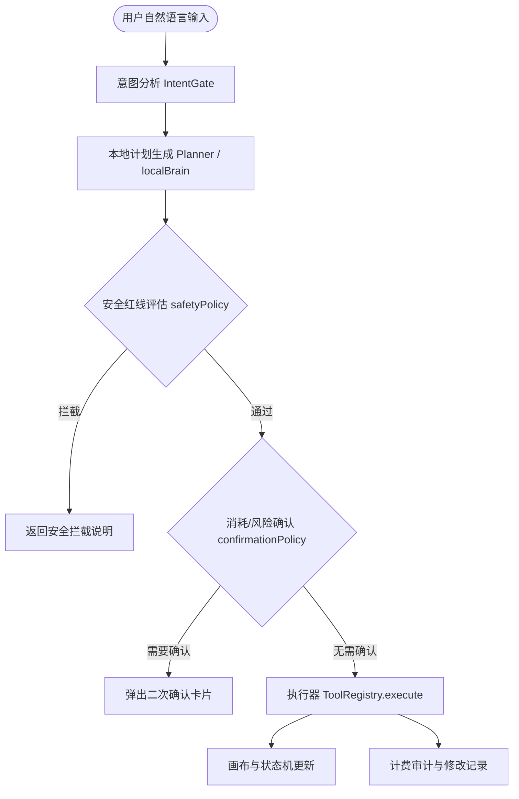

Status: historical

# KK Studio v1.6.1 完整系统架构与开发指南

本指南面向 KK Studio（当前版本：**v1.6.1**）的研发工程师与 AI 编程 Agent，提供全面的项目架构、模块职责、核心业务流、AI 助手接管系统、安全红线以及测试验证体系的规范性梳理。

---

## 1. 项目全局概述与模块边界

KK Studio 是一个项目级、画布级、任务级 AI 驱动的无限画布媒体生成平台。其仓库物理结构采用 Monorepo 机制进行多端与多服务管理，物理分布与职责约束如下表：

| 模块目录 | 模块名称 / 物理性质 | 核心职责与设计原则 | 禁止事项 |
| :--- | :--- | :--- | :--- |
| **`apps/web/`** | Web 前端主运行时 | 承载无限画布交互、UI 逻辑、AI 助手面板、数据层订阅。基于 React + Vite 驱动。 | 禁止引入 React Native/Expo API；禁止在组件内直接执行原生 Node/PG 数据库访问。 |
| **`apps/mobile/`** | 移动端原生 App 运行时 | 承载移动端的参数面板、会话流以及设置页。基于 Expo React Native 驱动。 | 禁止在移动端共享层直接调用 DOM/BOM 等浏览器专属 API。 |
| **`packages/shared/`** | 跨端纯 TS 共享契约 | 定义多端通用的数据结构、DTO、API 请求响应契约、枚举类型。 | 必须保持平台无关。禁止使用 React、DOM、Node.js 专用库。 |
| **`packages/api-client/`** | 统一 HTTP 客户端接口 | 封装 API 请求与响应拦截。支持多端（Web, App）统一接入，具备 Session 状态代理。 | 禁止将特定存储平台（如 `localStorage` 或 `AsyncStorage`）硬编码。必须采用依赖注入。 |
| **`packages/ui/`** | 设计系统与 UI 适配层 | 管理语义 Token、浅色/深色主题和核心基础 UI 组件（Bridge）。 | 禁止在此处写入任何具体的业务状态管理和模型生成逻辑。 |
| **`services/api/`** | Express / VPS 后端 | 承载计费核算、退款、API 密钥代理与解密、Stripe 支付 Webhook 验签、资产文件落盘。 | 禁止引入前端 React 等交互库；禁止为必需的环境变量提供不安全的默认 fallback 密钥。 |
| **`infrastructure/database/migrations/`** | 数据库结构变更唯一合法来源 | 承载所有 PostgreSQL 运行时 Schema 的 DDL 迁移脚本。 | 禁止通过普通业务代码或临时维护脚本隐式执行 `CREATE TABLE` / `ALTER TABLE` 等 DDL 操作。 |

---

## 2. 核心状态与画布数据模型

### 2.1 无限画布状态系统 (CanvasContext)
画布的核心状态由 `CanvasContext`（在 `apps/web/src/context/CanvasContext.tsx` 中）集中管理，包含：
- **`activeCanvasId`**: 当前聚焦的画布唯一标识。
- **`selectedNodeIds`**: 处于选中态的卡片节点 ID 列表。
- **`promptNodes` 与 `imageNodes`**: 描述画布上的生图节点。
  - `PromptNode`：包含提示词文本、目标模型 ID、生成参数、生成状态（`idle`, `generating`, `failed`, `done`）以及关联的子图像节点列表。
  - `ImageNode`：代表生成的实体图像，可能包含 `url`、`originalUrl`（无损原图）、`apiResultUrl`、`storageId`（本地存储 ID）、`sourceTaskId`、`parentPromptId` 等。
- **`viewportCenter` 与 `scale`**: 存储视口几何信息，供无限画布容器（`InfiniteCanvas`）执行缩放与视角平移（Transform）时使用。

### 2.2 画布运行态数据模型 (CanvasRuntimeState)
为方便 AI 助手感知“用户在做什么”，系统设计了统一的 `CanvasRuntimeState` 结构：
- **视口 (viewport)**：缩放比率、横纵视口位置中心坐标。
- **选区 (selection)**：对选中的 Prompt 节点和 Image 节点进行细化分类及去重，包含子图派生解析。
- **事件轴 (recentEvents)**：记录画布上最近的更新事件，供智能接管捕获。

---

## 3. 核心业务流工作机制

### 3.1 打包下载选中卡片原图
用户框选部分卡片或对 AI 助手发起“下载选中的图片原图”时，系统按如下优先级及降级链路处理：
1. **原图解析优先级**：
   $$\text{originalUrl} \longrightarrow \text{apiResultUrl} \longrightarrow \text{url} \longrightarrow \text{storageId} \longrightarrow \text{failedItems}$$
   系统会先寻找最清晰无损的 `originalUrl`，缺失时则寻找 API 原始返回图，若再无则回退到预览图或本地 indexedDB cache。
2. **清单生成 (manifest.json)**：
   压缩包（由 `JSZip` 打包）内必须自动附带 `manifest.json` 元数据，声明每个图片节点的 `nodeId`、对应 `parentPromptId`、对应生图提示词概要、所使用的 Model ID 及生成时间。

### 3.2 智能批量生成与画布整理 (Arranging)
批量生图任务以并发安全、幂等为核心原则：
- **并发控制**：默认并发数 $3$，最大并发限制为 $8$。
- **DurableJobQueue**：后台持久化异步任务队列负责执行生图，支持异常恢复、熔断重试（最大 3 次）。
- **智能整理 (Arrange)**：批量生成结束后，调用画布自动排版算法：
  - 若为单个 Prompt 卡片产生的多张子图，调用 `arrangeSingleSelectedPromptChildren`；
  - 若为多张不同图像或卡片，进行流式网格（Grid）平铺，计算无重叠的几何空间点。

---

## 4. AI 助手接管系统 (AI Takeover)

AI 助手的交互路径和防御规范严格遵循以下流水线：

### 4.1 权限矩阵与内置安全防线
- **安全防线 (`safetyPolicy`)**：拦截包含政治、暴恐、涉黄或者泄露隐私的指令。
- **二次确认防线 (`confirmationPolicy`)**：当指令将导致批量高额扣除系统积分、清空/删除大量画布节点时，必须打断执行并拉起 UI 确认。
- **本地脑 (`LocalAssistantBrain`) 与云端大模型脑 (`LLMBrain`)**：
  - 当检测到用户的 API 密钥未配置，且不属于平台预设指令时，进入 `LocalAssistantBrain`，给出模型配置高亮引导或错误诊疗建议。
  - 出于安全原因，AI 助手**永远不得读取、填写、保存、传输用户的 API 密钥或系统 Webhook Secret**。

---

## 5. 安全规范与积分红线

1. **API Key 物理隔离**：
   - 客户端专属密钥（Gemini API Key等）只能通过内存和本地加密的 `localStorage` 保持；
   - API 请求通过后端 VPS 做反向代理和鉴权，客户端**禁止直连**受保护的 AI 服务商（如 OpenAI, Gemini 官方 API 直连等），防止被窃取。
2. **积分原子扣减**：
   - 计费架构强制使用“预扣积分 $\rightarrow$ 执行生成 $\rightarrow$ 成功完成扣减 / 失败自动退款”的事务链。
   - 所有积分消耗与退款明细均记录至本地 SQLite / Postgres 物理审计日志中。

---

## 6. 测试与验证体系

KK Studio 部署了庞大的测试网络以防范修改造成 Regression，测试分为三层：

### 6.1 单元与契约测试 (`tests/unit/` & `tests/contract/`)
- 拥有超过 400 个自动化测试用例。
- 采用 **Node.js 原生 Test Runner** 运行：`node --test "tests/unit/*.test.ts"`。
- **契约断言**：许多测试用例（如 `SettingsModalProviders.test.ts`）通过直接静态解析特定源文件（如 `apps/web/src/components/settings/ApiSettingsView.tsx`）的源码，断言其是否包含了特定的安全边界、正则特征或功能桩，避免代码重构过程中逻辑被无意删除。

### 6.2 端到端冒烟测试 (`scripts/test/`)
- **`verify-desktop-settings-smoke.mjs`** & **`verify-mobile-settings-smoke.mjs`**：使用 Playwright 启动前端的本地 Vite 开发服务器（端口 3000）并控制 Chromium 浏览器，模拟进入 `/settings`、开启 Advanced Mode、以及点击对话和设置操作的完整链路。
- **E2E 覆盖分析**：
  - *已覆盖*：桌面端/移动端设置面板操作、API 供应商添加/高级配置逻辑、启动时的 Banner 排版对齐、提示词卡片拖拽与排版。
  - *未覆盖的 E2E 场景*：正式支付 Stripe Webhook 的闭环测试（仅有单元 Mock 测试）、真实的图像与音频生成响应、带历史会话恢复的文件打包。对于该部分，系统主要依靠单元 Mock 和接口契约测试进行防范。
- **`tests/e2e/workspace-canvas.test.ts`**：在 `tests/e2e/` 下存放系统核心画布交互的端到端契约测试，可以通过运行 `npm run test:e2e` 执行。

---

## 7. 编码规范与乱码防护

- 所有文件（代码、文档）统一默认使用 **UTF-8 without BOM** 编码，以及 **LF (Line Feed)** 换行符。
- 在使用 PowerShell 写文本时，必须显式附加 `-Encoding utf8NoBOM`，严防中文出现 Mojibake（乱码）。
