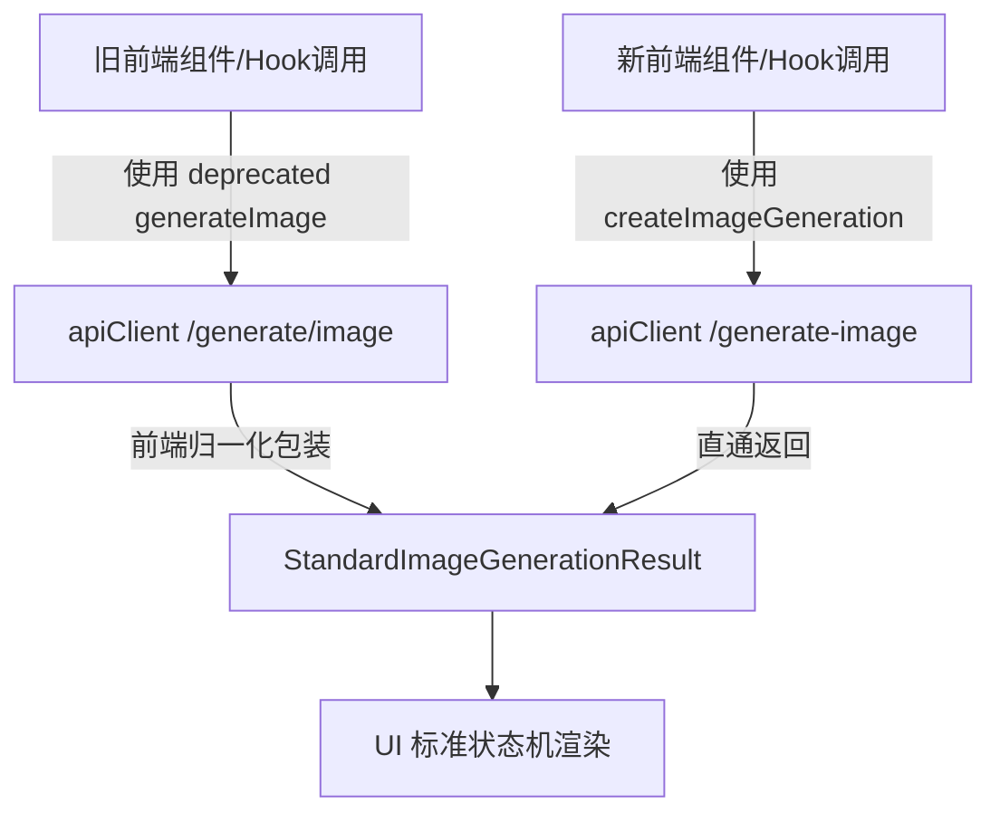

Status: historical

# API 契约与过渡迁移方案 (API Contract Migration Plan)

本文件说明 `KK Studio` 从旧图像生成协议向 `StandardImageGenerationResult` 统一标准契约过渡的演进细节与兼容方案。

---

## 1. 迁移路线图



过渡期原则：**双轨并行，单轨消费。** 
后端和前端的旧 API 允许暂时保留以防历史代码断裂，但新开发的逻辑和组件必须全面对接统一的 `StandardImageGenerationResult` 数据。

---

## 2. 接口契约对照表

### 2.1 请求参数对照

| 字段名 (旧 generateImage) | 字段名 (新 StandardImageGenerationInput) | 类型 | 说明 |
| :--- | :--- | :--- | :--- |
| `prompt` | `prompt` | string | 生成提示词 |
| `referenceImageBase64` | `referenceImages` | string \| Array | 支持带 MIME 类型的参考图数组 |
| `aspectRatio` | `aspectRatio` | string | 宽高比，如 "1:1", "16:9" |
| `executionLane` | `executionLane` | string | 'local-user-api' \| 'cloud-credit-model' |
| - | `requestId` | string | 统一的链路追踪 UUID |
| - | `providerId` | enum | 供应商标识 |
| - | `modelId` | string | 模型 ID |

### 2.2 返回结构归一化对照

旧版接口只返回简单的 Base64：
```json
{
  "image": "base64_string...",
  "text": "optional text..."
}
```

新版 `StandardImageGenerationResult` 则以矩阵形式整合所有信息：
```json
{
  "requestId": "uuid-xxx",
  "providerId": "google",
  "surface": "provider-images",
  "modelId": "gemini-2.5-flash-image",
  "status": "success",
  "urls": ["/uploads/kkai-gen-xxx.png"],
  "taskId": "optional-async-task-id",
  "billing": {
    "deducted": true,
    "ledgerId": "transaction-123"
  }
}
```

---

## 3. 兼容过渡辅助函数

在前端 `packages/api-client` 和后端 `server` 中分别提供相应的 Wrapper。

### 前端过度层
```typescript
export function normalizeLegacyGenerateImageResponse(
  legacy: { image: string; text?: string },
  requestId: string,
  modelId: string,
  providerId: string
): StandardImageGenerationResult {
  return {
    requestId,
    providerId: providerId as any,
    surface: 'provider-images',
    modelId,
    status: 'success',
    urls: [legacy.image],
    raw: legacy
  };
}
```

### 后端过度层
后端 `/generate/image` 和 `/generate/edit` 路由在重构后，底层均调用 Dispatcher 获得标准结果，但为了不破坏旧版客户端（如移动端或历史桌面端）的消费，由 `normalizeServerGenerateImageResponse` 将标准结果转换为 `{ image: string, text?: string }` 格式回传。

---

## 4. 架构禁令与静态规则

1. **绝对禁令 1**：在 `apps/web/` 的组件代码中，绝对禁止导入原有的 `generateImage`。必须通过 `createImageGeneration` 获取标准结果。
2. **绝对禁令 2**：在 UI 侧绝对禁止直接消费 `.image` 属性，必须通过 `.urls[]` 渲染。
3. **架构静态检查**：在 PR 8 中挂载的静态脚本，将直接扫描是否有 UI 组件直接导入并使用旧契约，发现则抛出 Lint/Architecture Error 阻止 CI/CD。
