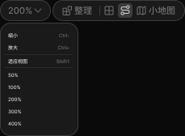
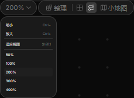

# 导航同状态比对 — 2026-09-07

本轮独立小交付：复核中断任务留下的两个失败修复，完成导航 200% / 比例菜单展开状态比对，并将文字字重从 400 改为原稿的 500。只改导航局部 CSS 两行，现有导航、数量、声音、画布修复均为上一轮实现，本轮未重建。

## 来源与状态

- Figma 文件 `0nU0A7pq6eyjwfwm1TtWkO`，节点 `100:16335`。参考当日已缓存的 [设计上下文](../../reference/navigation-fix-2026-09-07/100-16335-context.txt) 与 [原稿 PNG](../../reference/navigation-fix-2026-09-07/100-16335.png)。
- 本次设计读取失败原文：`This app connection requires reauthentication before other actions on this app can succeed.` [工具原始结果](../../reference/navigation-review-2026-09-07/design-context.json)。未重试相同失败；缓存不能证明远端此刻没有修改。
- 本次递归动效成功返回 `nodes: []`，见 [结果](../../reference/navigation-review-2026-09-07/motion-context.json)。上午原型缓存遍历导航 45 节点没有 reactions；这些证据仅限导航节点，不涵盖视频声音等其它模块，也不能作为 140/220ms 工程过渡的来源。
- Edge，1920×1080，缩放 200%，比例菜单展开，连线显示，指针移离导航。测试使用当前前端内容；原稿外围黑色留白与运行时画布网格不作为该局部控件的差异像素。

## 同状态结果

| 对象 | Figma 缓存原稿 | 当前 Edge | 结论 |
| --- | --- | --- | --- |
| 导航外框 | x1158 y84，229×26 | 相同 | 坐标/尺寸差值均为 0 |
| 比例按钮 | x1158 y84，63×26 | 相同 | 与原稿一致 |
| 功能组 | x1223 y84，164×26 | 相同 | 与比例按钮间隔 2px |
| 比例菜单 | x1158 y112，97×140 | 相同 | 与导航间隔 2px |
| 菜单背景/描边/圆角 | #1a1a1a / #3c3c3c / 13px | 相同 | 与原稿一致 |
| 字重 | Inter Medium 500 | 修改前 400，修改后 500 | 已修正，实测所有导航按钮为 500 |
| 聊天区间距 | 历史主画板参照 25px | 25px；聊天区 x1412 y63，476×985 | 与历史参照一致，尚缺本次最新主画板回读 |

原稿：

当前实现：

[修改前截图](navigation-before.png) · [完整同状态截图](workspace-1920-same-state.png) · [导航与聊天间距](navigation-chat-spacing.png) · [测量 JSON](comparison.json) · [修改前测量](comparison-before.json) · [可重复采集脚本](capture.cjs)

## 验证

- Node v24.20.0；先运行 14 项针对性检查，通过，包含原始 Shift+Digit1 输入、390px 新卡片完整编辑区、画布快捷键、菜单回焦、比例切换、连线、背景及四视口可触达。[报告](targeted-results.json)。
- 字重改动后执行一次 `npm run verify`，退出码 0：类型检查、12 项核心测试、格式检查、生产构建、44 项 Edge 测试通过；0 失败、0 跳过、0 flaky。[完整日志](verify.log) · [浏览器报告](verify-browser-results.json)。
- 当前真实浏览器采集脚本退出码 0，四组原稿几何差值全部为 0，控制台异常 0。构建 JS gzip 96.23 KB。上述检查与目视同状态比对分别记录，不把测试通过当作设计验收。

## 剩余差异及边界

- 原稿未标明当前比例行选中底色；实现保留了 #1f1f1f 作为当前比例反馈，`aria-checked` 与键盘焦点属于工程交互补充。
- 菜单正文使用全局 #dadada，原稿 #dbdbdb，仍差 1 级 RGB；中文字体回退和字形栅格化尚未逐像素收敛。
- 背景按钮本身有原稿依据，但系统颜色选择器弹层尚无原稿状态证据；小地图内部动态内容、移动端菜单 12px/28px 行高、画布网格仍为工程补充。
- 本轮只比对导航展开状态，不代表整张工作台、其它状态、动效或全部页面准确还原。未请求后端、未重建 Plate、未发布、未提交或清理现有工作树。

## 八项自审

| 项目 | 结果 |
| --- | --- |
| 完整性 | 两个历史失败收口、导航同状态比对、字重修正和证据落盘；其余页面保留待办 |
| 正确性 | 布局及字重来自具体节点；聊天位置的历史证据边界单独标明 |
| 健壮性 | 针对性及全量回归覆盖键盘、缩放、草稿保留和四视口；未放宽原几何断言 |
| 结构 | 仅现有导航 CSS 增加两条字重声明，无新状态、依赖或组件 |
| 性能 | 无新资源；Inter 500 已存在，JS gzip 96.23 KB；无大画布性能结论 |
| 安全 | 无外部写入用户设计、无密钥、无数据迁移；自动化仅更换接续任务 |
| 验证证据 | Node 24 全量检查退出 0，真实浏览器截图与测量分开保存 |
| 更好方案 | 避免为字重差异重新搭建导航；保留缺少设计依据的差异说明，后续按对应状态补证 |

## 下一步

交付只读复查：`review_navigation_evidence` 对本轮两行 CSS、源稿、修改前后测量与日志统计检查后无阻断意见；确认字重为 500，12/44/14 项验证统计一致，缓存时效与残余差异没有被夸大。复查未修改文件或重跑测试，不覆盖其余遗留工作树。

沿既有视频参数组件继续核对 `170:8853`（297×229 参数弹层）及 `170:8490`：读取已有来源，对照比例、分辨率、时长和菜单关闭/回焦状态；数量 1/2/4/6/8 与声音切换已实现，不再重复施工。最新远端状态与背景弹层证据需要 Figma 设计读取恢复。整体保持 Repairing。
