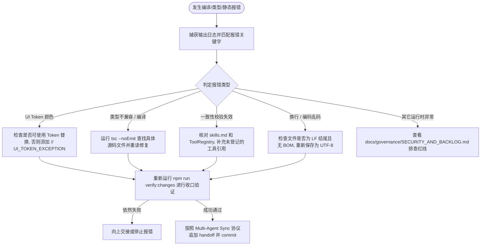

Status: reference

# AI 快速排障与调试规约 (Diagnostics & Debugging Guide) - KK Studio v1.6.1

本指南专为研发人员与 AI 编程 Agent 设计。当系统发生运行期崩溃、静态检查阻断、编译报错或一致性验证熔断时，AI 可通过本规约快速定位错误根源，极速恢复项目健康运行。

---

## 🧭 1. 系统诊断命令全集

在执行任何功能修改或环境升级时，应当使用以下命令链进行错误筛查：

| 诊断命令 | 执行位置 | 核心检验目标 | 熔断反应与定位策略 |
| :--- | :--- | :--- | :--- |
| `npm run typecheck` | 根目录 | 静态 TS 类型安全性与编译检验。 | 报错时直接指向具体的行号与 TS 规则违规。 |
| `npm run architecture:check` | 根目录 | AST 级别物理边界规则、UI 导入及硬编码 Token 静态检验。 | 若存在隐藏 DOM 写入、UI Token 硬编码、重排 `z-index` 会在此报错。 |
| `npm run governance:check` | 根目录 | 版本事实一致性、注册工具、安全红线敏感防区等校验。 | 若新增 confirm 级工具未在 Skills 说明，或版本不一致时会阻断。 |
| `npm run check:encoding` | 根目录 | 文件保存编码（UTF-8 without BOM + LF）和乱码防范校验。 | 扫描全仓是否存在 GBK、UTF-16、CRLF 换行或 Mojibake 异常字符。 |
| `npm run test` | 根目录 | 单元测试、集成测试、契约测试和 E2E 冒烟测试全套运行。 | 测试失败时会打印具体 Test Case 与断言差异。 |
| `npm run build` | 根目录 | Vite 生产环境打包编译。 | 捕获 Web 运行时因 Tree Shaking 或构建环境缺失导致的致命打包错误。 |
| `npm run verify:changes` | 根目录 | 包含以上所有诊断命令的 CI 级最终收口校验。 | 任何一步失败即代表无法发布上线，通常是 Agent 交付的最终检查。 |

---

## 🔍 2. 常见核心故障排障指南

### 2.1 UI Token 静态边界校验失败 (`[UI Token Check]`)
* **错误表现**: 运行 `npm run architecture:check` 报错并列出大量的 `Found hardcoded color literals` 文件位置。
* **定位原因**: 在 TSX 组件或 CSS 文件中写入了硬编码的颜色代码（如 `#ffffff` 或 `rgba(0,0,0,0.1)`），没有使用组件库中的预设 Token。
* **修复方法**:
  * **优先方案**: 将颜色替换为 `packages/ui/` 声明的语义 Token 或由 `activeTheme` 动态提供的主题色。
  * **特例方案**: 如果是不可避免的硬编码（如品牌官方 Logo 填充色、Canvas 的 2D 绘图 Context 刷白等），在颜色声明所在行的末尾，添加 **`// UI_TOKEN_EXCEPTION`** 行内注释，静态分析 AST 脚本检测到该标记后会自动予以豁免通过。

### 2.2 敏感工具校验不一致 (`[一致性校验错误]`)
* **错误表现**: 运行 `npm run governance:check` 提示 `敏感操作工具 xxxx 没有在 Skills 规约中被说明`。
* **定位原因**: `ToolRegistry.ts` 中注册的工具中，有工具标记为了 `confirm` 或 `dangerous` 权限，但 `docs/ai-assistant/skills/` 中没有任何技能 Markdown 文件提及该工具。
* **修复方法**:
  * 定位到对应的技能文档（如 `batch-generate-to-canvas.md`），在文档的 `关联工具` 或 `Tools` 块中加入被提及工具的 `` `namespace.toolName` `` 反单引号声明。
  * 确保重新运行 `npm run governance:check` 能够无误通过。

### 2.3 Vite 开发热更新 (HMR) 监听失效
* **错误表现**: 修改 `apps/web/` 下的代码后，浏览器中没有自动刷新，必须手动刷新，或者开发终端没有打印 HMR 相关日志。
* **定位原因**: `apps/web/vite.config.ts` 中的 `server.watch.ignored` 规则过滤了过多的父级目录，导致 `chokidar` 无法向下监视。
* **修复方法**:
  * 检查 `vite.config.ts` 的 `shouldIgnoreWatchPath` 过滤函数，确保不忽略 `/apps/web/src/` 下的核心源码文件监视，去除对于含有子串的过度拉伸排除。
  * 运行 `npm run dev:restart` 重启开发环境守护进程。

### 2.4 后端 Express / VPS 服务拒绝启动
* **错误表现**: 运行 `npm run api:start` 或 `npm run dev:start` 后，服务器抛出错误并退出。
* **定位原因**: 后端防区强制校验了系统生存所必须的环境变量（见 `SECURITY_AND_BACKLOG.md` 中的 `REQUIRED_ENV_VARS`），任何硬编码 fallback（即 `|| "default"`）被严格禁止。若没有在本地 `.env` 文件中提供有效参数（如缺失 `JWT_SECRET`），服务会自动崩溃拦截。
* **修复方法**:
  * 打开并检查根目录下的 `.env` 配置文件（如不存在，可复制 `.env.example` 重新生成）。
  * 补齐所有必需的密钥和配置项，保存后重新拉起后端进程。

### 2.5 数据库契约错误 (DDL Exceptions)
* **错误表现**: 业务接口请求报错：`relation "xxxx" does not exist`。
* **定位原因**: 尝试对不存在的数据表进行增删改查。
* **修复方法**:
  * **禁止直接在业务层或命令行连接生产库运行 `CREATE TABLE`**。
  * 在 `infrastructure/database/migrations/` 目录下创建幂等的 DDL SQL 迁移脚本（遵循 `infrastructure/database/migrations/` 时序文件命名），将表结构变更脚本固化在此，由 Express 启动时自动完成水合或迁移。

---

## 🛠️ 3. AI Agent 快速故障感知与处理流

当 AI Agent 执行任务时，如若遇到异常，应立即遵循以下处理逻辑链：

### 3.1 强一致性防御：修复后必须提交
所有排障修复成功、且全套 `npm run verify:changes` 校验通过后，Agent 必须强制：
1. 追加最新的排障与修复说明至 `docs/development/session-handoff.md`。
2. 运行 `npm run agents:commit` 将该修复安全沉淀为本地 commit。
