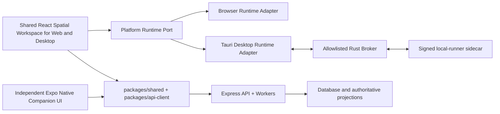

# KK Studio 1.7.0 AI Spatial Workspace Design

**Status:** Approved design for implementation planning. Route A was selected by the user on 2026-08-13 and passed independent architecture/security and product/UX blocker review.

**Release scope:** Windows 10/11 native desktop first, Web parity second, Expo mobile companion in the same 1.7.0 release program. The architecture must remain macOS-ready, but macOS distribution is not a 1.7.0 release claim.

**Version rule:** The released version remains 1.6.1 until every 1.7.0 stable gate passes. Gate 0 extends the sole version source, `config/release-manifest.json`, so it can also declare `releaseTarget: 1.7.0`, `releasePhase`, `releaseSequence`, and a monotonically comparable candidate artifact version such as `1.7.0-rc.N`. Preview/canary artifacts derive from that manifest; packages cannot invent their own versions. Only Gate 6 changes the released/stable version to 1.7.0.

## 1. Decision

KK Studio 1.7.0 will evolve the current product into a local-first AI Spatial Workspace:

- the infinite canvas remains the primary work surface;
- direct manipulation remains first-class;
- AI is a visible collaborator with `direct`, `assist`, and `takeover` modes over one shared runtime state;
- the Windows application starts, works, resumes, and updates without opening a browser;
- Desktop and Web reuse the same product UI and domain contracts instead of developing parallel applications;
- `local-desktop`, `paired-desktop`, and `cloud` execution are explicit lanes; independent stable Job and Run IDs are connected through correlation/causation lineage;
- mobile becomes a real companion for project access, prompt submission, approval, task tracking, result review, and remote desktop handoff;
- beautiful motion explains spatial and execution relationships without compromising input latency, accessibility, or 10K-canvas performance.

This is an evolutionary rebuild, not a blank-slate rewrite. The current custom canvas, `CanvasRuntimeState`, `ToolRegistry`, generation-v3 contracts, billing truth, Asset lineage, and existing API service remain the foundation. Components and orchestration are replaced behind bounded adapters and feature flags only after their replacements pass the same-state and rollback gates.

## 2. Why this route

Route A has the best delivery-to-risk ratio:

1. It preserves the current canvas behavior and 10K performance work instead of betting the release on a new canvas engine.
2. It lets the native desktop product reuse the existing React/Vite application while adding OS-level lifecycle, secure local execution, deep links, files, and signed updates.
3. It turns the current AI features into one observable execution system rather than adding another chat surface.
4. It allows Desktop to prove the architecture first while Web and mobile consume the same contracts afterward.
5. It keeps Electron as a measured fallback if the Windows WebView2 spike fails, rather than paying Electron's packaging and security cost before evidence requires it.

## 3. Product promises and traceable requirements

Every implementation plan and pull request must map its work to one or more requirement IDs below.

| ID | Product promise | Release evidence |
|---|---|---|
| P-01 | Canvas first | Launch and task flows return to the user's last canvas; AI panels never replace the work surface. |
| P-02 | No-browser desktop | Installed Windows builds launch and operate the workspace without opening a browser. Explicit OAuth, help, or user-selected external links are named security exceptions. |
| P-03 | Local-first, not local-only | Project state and local-capable work remain usable without the API; cloud jobs and billing remain server-authoritative and recover after reconnect. |
| P-04 | Transparent AI control | One visible `direct / assist / takeover` control, one plan, one progress stream, and explicit confirmation for cost-bearing, destructive, external, or irreversible actions. |
| P-05 | Durable work and migration | Existing 1.6.1 local work has a non-destructive migration path, and close, crash, runner restart, reconnect, or update cannot silently lose, blindly replay, or falsely complete work. |
| P-06 | One product across Desktop and Web | The same UI/domain modules and shared contracts drive both surfaces; platform differences live behind runtime adapters. |
| P-07 | Useful mobile companion | Mobile uses real authenticated KK APIs for projects, tasks, approval, review, prompt submission, notifications, and paired-desktop handoff. |
| P-08 | Safe in-app updates | Authenticode artifacts, updater artifact signatures, independently signed anti-replay release metadata, explicit channels, drain/checkpoint, relaunch health, and an external recovery/roll-forward path. |
| P-09 | Fast, accessible, spatial UI | Keyboard and touch operation, visible focus, reduced motion, no control duplication, and no regression to existing 10K/media budgets. |
| P-10 | Accountable release | Version truth, installer, API, migrations, Web, mobile, tests, documentation, and staged rollout all agree before the 1.7.0 version bump. |
| P-11 | Measurable capability parity | A checked-in matrix names supported direct-edit, AI, task, import/export, and accessibility capabilities per Desktop, Web, Touch Web, and mobile surface, with test evidence or an explicit unsupported state. |

## 4. Scope boundaries

### 4.1 In scope for 1.7.0

- a production Windows desktop application built with Tauri 2;
- an automated signed Windows update path;
- automatic lifecycle management for the existing `local-runner`;
- a unified Spatial Workspace shell;
- consolidation of the current Composer, AI sidebar, inspector, and task surfaces;
- generation-v3 as the authoritative cloud generation path used by the canvas;
- explicit `local-desktop`/`paired-desktop`/`cloud` execution routing;
- resumable Agent execution with bounded authority and recovery evidence;
- Web parity from the same implementation;
- real Expo mobile companion flows;
- release telemetry that excludes prompts, secrets, private assets, and user content;
- a full installer, update, security, performance, accessibility, and recovery test matrix.

### 4.2 Explicit non-goals

- replacing the current main media canvas with React Flow, tldraw, Excalidraw, or another general canvas;
- moving business logic, Provider routing, billing, or Agent planning into Rust;
- introducing a second backend, API client, AI assistant, task model, or billing truth;
- claiming automatic binary rollback that Tauri does not provide;
- shipping macOS before signing, notarization, update, and hardware validation exist;
- claiming full 10K spatial editing on a phone. Mobile 1.7.0 is a production companion; tablet-grade spatial editing can follow only after a measured native interaction design;
- exposing arbitrary shell, filesystem, browser selector, or network execution to the Agent;
- changing pricing or payment business rules as part of the visual rebuild.

## 5. Target experience

### 5.1 Launch and resume

1. The native window appears without an intermediate terminal or browser.
2. The shell restores the last project, canvas viewport, selection-safe UI layout, and recoverable task projections.
3. A compact status strip shows sync state, local runtime health, global task count, update state, and account state.
4. If local services are unavailable, the canvas still opens and the unavailable capabilities explain how to recover.
5. If a prior run is recoverable, the user sees its verified state and available actions; the application never changes an active run to failed merely because the window closed.

### 5.2 Create with AI

1. The user imports references, selects existing nodes, or describes a goal in the single Composer.
2. `IntentGate` classifies the visible request kind and risk.
3. `Planner` returns output requirements, capability constraints, targets, landing area, expected outputs, and lane/route hints. It never invents price.
4. RouteEngine and the Quote service resolve the authoritative route and Quote; the UI shows the accepted Quote before any cost-bearing confirmation.
5. In `direct` mode the user performs edits and AI may explain or preview only.
6. In `assist` mode AI proposes bounded operations; every write requires user approval.
7. In `takeover` mode AI executes an approved bounded plan and continuously exposes step status, verification, pause, cancel, and intervention controls.
8. Results land near their source or designated frame, preserve Asset lineage, and remain normal editable canvas objects.
9. The user can edit, compare variants, promote a result, retry eligible failures, or export.

### 5.3 Failure and recovery

A failed operation must preserve:

- the original user input reference without logging private content;
- selected model, route, and execution lane;
- Run, Job, Quote, and Item identifiers as applicable;
- billing/settlement status;
- completed and pending steps;
- retryability and whether retry can reuse the original quote;
- actionable recovery: retry, change route, reconnect, reauthorize, open task details, continue manually, or cancel.

A toast may announce a failure, but it cannot be the only durable representation of the problem.

### 5.4 First-run path

An empty-canvas first run is a short success path, not a mandatory tour. Restoring an existing project or interrupted task always takes priority:

1. Open the last canvas, or show an empty-canvas welcome state.
2. Offer exactly three primary starts: describe a goal, import material, or use a template.
3. Let AI show scope, references, landing area, and lane; let the product UI show the authoritative server Quote when cost applies.
4. Let the user choose or keep the default `direct` mode and proceed.
5. Land editable results on the canvas with compare/export/continue actions.

The welcome state is skippable and keyboard-complete. Before login it is stored against an anonymous installation identity; after login that acknowledgement migrates once to the owner plus major product version. It never repeatedly blocks an existing user.

If no Provider is configured, entered text and attachments remain intact while setup is completed, then return to the same task in one action. Temporary attachments are encrypted at rest, owner/installation-scoped, size-limited, retention-limited, and removed on explicit cancel or expiry; Gate 0 fixes the exact limits and restart policy in a tested contract. Where platform credits offer a valid route, first creation does not require users to learn Provider/Connection terminology.

The product does not add artificial "AI thinking" delay. Existing fixed waits whose only purpose is simulated personality are removed from the production path. Tutorials and empty states describe only capabilities that the current surface actually supports.

## 6. Spatial Workspace information architecture

### 6.1 Desktop composition

`WorkspacePage` becomes an assembly surface rather than the owner of every behavior.

```text
┌─────────────────────────────────────────────────────────────────────┐
│ Project · Sync · Local Runtime · Update · Tasks · Account           │
├────────────┬──────────────────────────────────────┬─────────────────┤
│ Resource   │                                      │ Intelligence    │
│ Rail       │          Infinite Canvas             │ Dock            │
│            │                                      │ AI | Inspect |  │
│ Projects   │                                      │ Run             │
│ Assets     │                                      │                 │
│ Templates  │                                      │                 │
│ Tools      │                                      │                 │
├────────────┴───────────────┬──────────────────────┴─────────────────┤
│ Navigation · Minimap       │ Single Composer + mode + context       │
└────────────────────────────┴─────────────────────────────────────────┘
```

The regions have strict ownership:

- **Status strip:** project identity, sync, runtime, update, global task entry, and account. It does not contain editing tools.
- **Resource rail:** projects, assets, templates, and tools. It can collapse or overlay, but never permanently steals canvas width on compact windows.
- **Infinite canvas:** selection, transform, node editing, frame/workflow organization, connectors, and direct manipulation.
- **Intelligence Dock:** exactly three contextual tabs: AI, Inspect, and Run.
- **Navigation/minimap:** zoom, fit, search-to-object, and real viewport minimap.
- **Composer:** the only prompt submission surface in the workspace.

The top Task Center is the single global task collection. The Dock's Run tab shows only the current or selected run; it is not a second task center.

### 6.2 Composer

The Composer exposes two orthogonal values:

- `requestKind: create | ask | command` describes what the submission means;
- `collaborationMode: direct | assist | takeover` describes how much execution authority AI receives.

`IntentGate` may recommend a request kind from text and current context, but the final kind is visible before submission. Ambiguity, a change from read-only to write, or any cost-bearing interpretation requires the user to choose or confirm the kind. Chat, generation, and Agent paths cannot independently reinterpret the same submission after it leaves the Composer.

The Composer then uses progressive disclosure:

- primary row: prompt, attachment/reference entry, voice, mode, and submit/cancel;
- contextual row: selected references, model/capability, output profile, cost/quote, and advanced parameters;
- advanced settings open in an anchored popover or sheet and never create another prompt bar;
- dragging references changes their stable order and visibly updates the plan context;
- long prompts expand up to the existing ten-line limit, then scroll;
- Enter/Shift+Enter behavior is explicit and consistent across Desktop and Web.

The `direct / assist / takeover` control must exist once in the DOM, remain keyboard-operable as a radiogroup, and stay visible without opening a parameter menu.

The `requestKind x collaborationMode` matrix has contract tests. In `direct`, `create` performs one explicit generation submission, `command` performs at most one explicit approved tool action, and `ask` is read-only. `assist` may propose a plan but confirms every write. `takeover` may execute a bounded multi-step plan under section 11.

### 6.3 Intelligence Dock

- **AI:** conversation, proposed plan, references, decisions, and verification summary.
- **Inspect:** selected node properties, lineage, model/source metadata, and type-specific tools.
- **Run:** current plan steps, execution lane/device, progress, cost state, confirmations, errors, logs safe for the user, and recovery actions.

The dock can be resized, collapsed, or temporarily overlaid. Its state is owned by the unified workspace layout state, not independently by multiple components.

### 6.4 Command palette

A global command palette exposes navigational and reversible commands. It queries `ToolRegistry` for availability but does not bypass `PermissionPolicy`. Destructive, cost-bearing, external, and irreversible actions still require the same confirmation path as visual controls.

### 6.5 Responsive behavior

- Wide desktop: rail and dock may remain visible around the central canvas.
- Compact desktop/Web: rail and dock become mutually manageable overlays with preserved canvas focus.
- Touch Web: use the existing mobile workspace projection and bottom sheets; do not attempt to compress the full desktop chrome into the viewport.
- Mobile native: use companion-specific screens described in section 13.

All touch targets are at least the existing 44 px token. Safe-area, IME, virtual keyboard, and screen-reader navigation are release gates.

### 6.6 Capability parity matrix

Gate 0 checks in a machine-readable matrix covering at least selection/multi-select, move/resize, grouping, connectors, pan/zoom/fit, undo/redo, import/export, search/locate, generation, card editing, task control, AI modes, keyboard shortcuts, and accessible alternatives.

Each Desktop, Web, Touch Web, iOS, and Android cell is `full`, `limited`, `read_only`, or `unsupported` and references a test ID or an explicit product explanation. "Shared UI" never substitutes for parity evidence, and mobile companion limitations remain visible.

## 7. Motion and visual system

Motion communicates causality:

- selection changes anchor tools to the selected object;
- a submitted plan visually links its references, affected nodes, and landing frame;
- generated results arrive from a reserved landing region rather than teleporting from arbitrary coordinates;
- dock and rail transitions preserve the user's canvas focal point;
- task completion and failure update the originating node and Run projection together;
- mode changes use a restrained state transition and never imply authority that was not granted.

Implementation rules:

- reuse `packages/ui` tokens and primitives such as `KkSurface`, `KkComposerShell`, and `KkSheet`;
- keep existing 100 ms fast, 125 ms standard, and 160 ms panel durations for micro-interactions;
- add any longer spatial duration only as a measured design token in `packages/ui`, defaulting to at most 240 ms;
- prefer transform and opacity; avoid layout-thrashing animation on canvas paths or large media;
- make every transition interruptible, with input acknowledgement on the first frame rather than after animation completion;
- honor `prefers-reduced-motion`, the native reduced-motion setting, and the existing application motion preference; any one of them requesting reduction wins;
- never delay input acknowledgement or error visibility for animation;
- do not add an animation library until bundle/import measurement proves the existing stack cannot satisfy a named interaction.

## 8. Platform architecture



Expo does not import the Web/DOM workspace UI or its Platform Runtime Port. It shares only platform-neutral contracts and the typed API client. The runner cannot write an abstract authoritative projection directly; bounded results return through the Rust broker and Desktop coordinator, then synchronize through the declared API/projection path when online.

### 8.1 Repository placement

The implementation plan should converge on these boundaries:

```text
apps/desktop/
  src-tauri/                 # native shell, capabilities, updater, lifecycle
apps/web/src/platform/
  runtime/                   # typed port and Browser/Desktop adapters
packages/shared/
  src/...                    # platform-neutral contracts and schemas
packages/api-client/
  src/...                    # authenticated server operations
packages/ui/
  src/...                    # tokens and reusable presentation primitives
apps/mobile/
  src/...                    # Expo companion UI using shared contracts/client
local-runner/
  ...                        # existing local execution process, hardened
services/api/
  ...                        # authoritative cloud business execution
```

`apps/desktop` contains shell code only. It must not fork `WorkspacePage`, Provider logic, billing, AI planning, or canvas state.

### 8.2 Platform Runtime Port

Shared Web/Desktop UI code requests capabilities through a typed port instead of reading `window.__TAURI__` or browser globals throughout the application. The port covers only platform differences:

- app/version/channel information;
- lifecycle and window commands;
- safe file open/save/import/export;
- deep-link handoff;
- update state and install request;
- local-runner health and pairing;
- OS notifications;
- secure local credential references;
- capability availability.

Unsupported operations return a structured `unsupported` result. They do not pretend to succeed.

The browser adapter uses existing Web APIs and server flows. The desktop adapter invokes narrowly scoped Tauri commands. Shared contracts contain no DOM, Node, React, or Rust-specific implementation.

### 8.3 State authority matrix

| State | Authority | Desktop behavior | Web/mobile behavior |
|---|---|---|---|
| Canvas editing state | Current canvas/workspace model plus the local persistence contract in section 9.4 | Local-first persistence plus existing sync | Same owner-scoped synced projection where supported |
| Quote, billing, settlement | API/database | Read and submit through typed API client | Same |
| Cloud Generation Job | generation-v3 service/Worker | Observe and control through owner-scoped APIs | Same |
| Local-desktop execution | Installation-local authority journal, epoch, and single-instance lock | May execute offline; cannot be remotely transferred while offline | Remote surfaces wait/observe last synchronized state |
| Paired-desktop execution | Owner-scoped server lease plus fencing token | Paired device holding the valid lease may execute | Remote surfaces may request/observe, never execute by projection alone |
| Cloud Agent execution | Restricted server Planner/Worker authority | Observe/control through owner-scoped APIs | Same; only declared cloud-safe tools are eligible |
| Agent Run projection | Owner-scoped server projection plus explicit execution authority | Recover projection; execute only with valid local authority | Observe; takeover requires authority transfer protocol |
| Provider Connection | Server-side encrypted connection or explicit local credential reference | Secret remains in its declared lane | No implicit secret copying between devices |
| App update | Signed channel feed plus installed app state | Desktop only | Web deploy and Expo update/store channels are separate release artifacts |

### 8.4 Planning and execution ownership

Submitting a DTO is not execution. Every request has one declared planning and execution owner:

| Work kind | Planning/route authority | Executor | Background behavior |
|---|---|---|---|
| Single cloud generation | RouteEngine plus Quote service | generation-v3 Worker | Continues without the initiating UI |
| Local-desktop Agent plan | Current Desktop Agent coordinator using the shared protocol | Local executor through Rust broker and runner | Continues only while the local runtime can safely checkpoint/execute |
| Paired-desktop Agent plan | The owner-scoped paired Desktop coordinator | Paired executor with server lease/fencing | Continues while the paired runtime renews authority |
| Cloud Agent plan | Owner-scoped server Planner using the same schemas/policy and a cloud-safe ToolRegistry projection | Restricted Cloud Agent Worker | Continues without the initiating UI |
| Read-only question | Declared assistant service; no execution grant | None | Response can resume from Session state |

The Cloud Agent Worker is a missing 1.7.0 implementation, not an existing capability claim. It can execute only tools explicitly marked cloud-safe; local files, local BYOK, desktop applications, and local browser state are excluded.

Web or mobile may send a planning request and later approve it, but cannot become the Planner/Executor accidentally. A `paired-desktop` or remotely requested `local-desktop` action without an online eligible desktop returns `requires_paired_desktop`; a cloud request without the server Planner/Worker returns `cloud_agent_unavailable`. The mobile-to-plan-to-confirm-to-execute flow must work while the mobile app is backgrounded and must have a real E2E for both cloud-safe and paired paths.

## 9. Native desktop shell

### 9.1 Technology choice

Use Tauri 2 with:

- NSIS current-user installation for the initial Windows release;
- Evergreen WebView2;
- a production build that embeds the Web assets;
- least-privilege Tauri capabilities;
- official updater plugin with mandatory artifact signatures;
- signed `local-runner` packaged as a sidecar.

Electron remains a fallback only if the spike demonstrates a release-blocking WebView2 incompatibility in the real 10K canvas, media decoding, WebGL, drag/drop, IME, accessibility, or local-runner lifecycle. The spike records identical measurements for both candidates before a fallback decision.

The production WebView loads only bundled application assets. Remote application code, arbitrary navigation, unapproved new windows, and broad shell/filesystem permissions are prohibited. Authentication that requires a browser uses system-browser or isolated-window OAuth with PKCE, `state`, and a validated deep link; no client secret is embedded in the app.

### 9.2 Desktop startup

The shell:

1. enforces single-instance behavior and routes secondary launches/deep links to the first instance;
2. creates the main window with a non-white safe startup surface;
3. initializes crash-safe local app metadata;
4. starts and pairs the runner when local capabilities are enabled;
5. hydrates the shared UI;
6. restores project/canvas and recoverable projections;
7. checks for updates only after the application is interactive.

The first implementation wave must fix and cover launcher paths containing spaces and non-ASCII characters. A project under such a path is a mandatory smoke fixture.

### 9.3 Window, files, and credentials

- close, quit, minimize-to-tray if later enabled, and update-restart have distinct semantics;
- unsaved local changes and non-checkpointable local tasks block quit/update with actionable choices;
- file dialogs return validated handles/paths through the adapter;
- imported and exported paths pass containment, extension, MIME, size, and symlink checks where applicable;
- drag/drop into the canvas uses the same validation and Asset import path as the file dialog;
- deep links carry identifiers, never secrets or raw prompts;
- long-lived session/refresh, pairing, and local BYOK material use a reviewed Windows Credential Manager/DPAPI-backed adapter and never renderer localStorage;
- Tauri capabilities are default-deny and scoped by window, command, and explicitly selected/app-owned directories.

### 9.4 Desktop persistence and 1.6.1 migration

Tauri WebView storage has a different origin from the user's existing browser/Portable storage. The native application must not pretend it can automatically read browser `localStorage`, IndexedDB, OPFS, or File System Access handles.

The Desktop persistence adapter uses:

- a versioned transactional SQLite store under app-owned data for canvas metadata, layout, checkpoints, task references, settings, and migration records;
- a content-addressed app-data store for local Asset bytes, with hashes recorded in the transaction;
- write-ahead/transactional updates, atomic temporary-file promotion, last-known-good checkpoint metadata, and corruption detection;
- owner and anonymous-installation namespaces;
- a bounded backup/repair/export path before any destructive schema migration.

Gate 0 defines a versioned KK workspace migration package and ships its exporter in the supported 1.6.1 Web/Portable compatibility path before native migration is required. The package contains schema version, Canvas/Session/settings data allowed for transfer, Asset manifest, content hashes, lineage references, and integrity metadata. It excludes authentication tokens, cookies, local BYOK, raw Provider secrets, and browser file handles.

Delivery is explicit:

- the existing production Web origin receives the backward-compatible exporter as an observed Web deployment while `releasedVersion` remains 1.6.1;
- Portable receives a signed side-by-side `migration-bridge` candidate, derived from `releaseTarget` and `releaseSequence`, that serves the exporter on the exact legacy origin required to read that origin's storage; it never live-overwrites the old Portable bundle;
- if exact-origin access cannot be proven, the bridge stops with guidance and never scans a browser profile or claims the data is absent.

Migration behavior:

1. Server-synced owner data rehydrates after a fresh explicit login.
2. Local-only data moves through an explicit export/import flow; the native app never scans arbitrary browser profiles.
3. Import validates schema, owner choice, archive paths, sizes, MIME, hashes, duplicates, and available disk space before commit.
4. Asset content hashes and stable migration IDs make retry idempotent.
5. A failed or cancelled import leaves the source package and original browser data readable and deletes no source.
6. Browser credentials are never copied; users re-enter local BYOK once into the OS credential vault.
7. Browser authentication is not migrated; the native app explains and performs a fresh secure login.
8. Migration tests cover 10K canvases, missing/corrupt Assets, duplicate import, old schema, quota exhaustion, interruption, and paths/names containing spaces and non-ASCII characters.

The application restores "last project" only after a native checkpoint exists or a migration/sync has completed. Before that, it presents the migration/relogin state honestly.

### 9.5 Desktop authentication

Desktop authentication is a Gate 1 vertical slice:

- an explicit system-browser OAuth flow uses Authorization Code plus PKCE, one-time `state`/nonce, and an allowlisted deep link;
- the API performs the supported code exchange and validates redirect, issuer, audience, owner, expiry, and replay;
- long-lived refresh/session material is stored through the OS vault adapter;
- the Desktop typed API-client transport sends authenticated requests through an allowlisted Rust broker so renderer code does not receive refresh tokens or local BYOK;
- renderer IPC receives only bounded DTO responses and short-lived UI-safe state;
- logout/revoke, owner switch, deep-link replay, expired code, lost browser return, offline login, and CSRF/CORS behavior have explicit tests;
- owner switch drains or pauses local work, clears owner-scoped caches and temporary attachments, invalidates pairing authority, and never displays the prior owner's projection.

First authentication for an owner requires network access. A previously authenticated owner may later unlock only that owner's OS-protected local namespace while offline, subject to local device/user-presence policy. Offline mode forbids adding or switching owners, cloud/paired authority, new server confirmations, and any inference that cached identity is current server authorization.

On reconnect the client revalidates the owner/session before upload or authority transfer. If the account/session was revoked or resolves to another owner, unsynchronized local work is quarantined read-only with an explicit export/re-auth path; it is not uploaded, deleted, or shown to the new owner.

## 10. Local runner lifecycle and security

The current `local-runner` remains a sidecar; business logic does not migrate to Rust.

The fixed trust boundary is:

```text
renderer -> allowlisted Tauri command -> Rust broker -> sidecar IPC/loopback
```

The renderer never connects to the runner directly, never owns `shell:allow-execute`, and never reads runner session credentials or local BYOK. The Rust broker launches only the exact packaged sidecar and injects bounded credentials/capability inputs from the OS vault. 1.7.0 packages a signed self-contained sidecar artifact with a pinned runtime and bundle; it does not depend on a user's system Node installation.

Required lifecycle:

```text
stopped -> starting -> pairing -> healthy -> draining -> stopped
                         |           |
                         v           v
                      degraded ----> failed
```

Security requirements:

- bind only to loopback and prefer an OS-assigned port;
- generate a high-entropy per-install identity and per-session credential;
- deliver the session credential between broker and sidecar through a protected OS mechanism; do not expose it in logs, URLs, command history, process arguments, or renderer state;
- verify exact Origin/Host and use constant-time credential comparison; a Tauri origin needs an explicit allowlist rather than `*`;
- rotate credentials after re-pairing and invalidate them on quit;
- sign the sidecar and verify expected identity/hash before execution;
- bind the handshake to nonce, PID, `protocolVersion`, `appVersion`, and a bounded capability manifest;
- package the app and sidecar as one versioned, atomically installed unit;
- use strict Zod/shared schemas for every command envelope;
- reject arbitrary shell, arbitrary URL, arbitrary selector, and unrestricted filesystem operations;
- enforce path containment, symlink rejection, MIME sniffing, body/file limits, decoder timeouts, concurrency limits, and cancellation;
- redact prompts, tokens, query strings, private filenames, and Provider payloads from diagnostic output;
- expose a typed health/capability snapshot, not a generic command tunnel.

If pairing or health fails, local-only actions become `setup_required` or `unavailable`. The cloud lane may remain available, but the UI must not silently reroute a private/local request to cloud.

All paired commands pass through `ToolRegistry -> PermissionPolicy -> Audit -> Verification`, use command-level lease renewal and a fencing token, and define an idempotency strategy for side effects. The current fixed-port experimental behavior and permissive Portable CORS/proxy paths are not production dependencies.

## 11. AI and execution architecture

Every AI action follows the existing protocol:

```text
IntentGate
  -> Planner
  -> CapabilityGraph / Route + Quote
  -> ToolRegistry
  -> PermissionPolicy
  -> Confirmation
  -> Executor
  -> Verification
  -> Memory / Knowledge Update
```

### 11.1 Mode contract

- `direct` is the default for a new installation. AI does not plan or mutate in the background; an explicit submit or tool action is required.
- `assist` may read the explicitly scoped context and propose previews/plans. Every write action requires user approval.
- `takeover` may execute safe, reversible steps inside an approved plan. Cost, destruction, external systems, permission expansion, or target changes still require confirmation.

All modes share `CanvasRuntimeState`, Session, Run, `ToolRegistry`, and the current selection. Switching modes never creates a new conversation, drops selection, or resets a task.

Runtime switching rules:

- `takeover -> assist/direct` lets the current atomic step finish or cancel safely, then prevents the next step from starting;
- `assist -> takeover` grants authority only for remaining validated scope;
- editing a proposed or accepted plan creates a new plan hash, reruns server validation, and requotes whenever price, route, input, target, or scope may change;
- owner, canvas, selection, plan, target, model/config scope, price, or Quote changes invalidate the old confirmation;
- a remote projection, historical Snapshot, metadata event, or expired grant never grants execution;
- current mode, current step, pause, stop, and intervention remain visible during execution.

The nine source/target mode combinations receive automated transition coverage for duplicate execution, duplicate billing, selection preservation, and confirmation invalidation.

### 11.2 One plan, explicit lanes

A plan step declares:

- tool and capability;
- target snapshot and landing region;
- `local-desktop`, `paired-desktop`, or `cloud` lane;
- proposed model/route hint;
- input/output Asset references;
- quote/cost bound when applicable;
- risk and confirmation class;
- retry/idempotency key;
- verification method.

The normal UI summarizes this as lane, authoritative quoted cost when applicable, and current step. Full Provider, Connection, Model, Capability, Channel, Quote, Job, and Asset evidence belongs in Run details.

The Planner may propose a route, but the authoritative RouteEngine/Provider Connection rules select the final cloud route. The UI never invents availability, price, or success. Lanes never silently fall back into one another.

### 11.3 Cloud lane

Canvas generation converges on:

```text
Quote -> generation-v3 Job -> durable Worker -> canonical Asset + lineage
      -> owner-scoped SSE/discovery -> Canvas + Task Center + Run
```

The 1.7.0 cutover eliminates duplicate authoritative submission between browser `DurableGenerationQueue`/legacy paths and generation-v3. Compatibility readers may remain during a measured window; there is one writer per migrated operation.

Billing and submission requirements:

- quote/channel/price version are frozen before execution;
- reservation, charge, and refund use idempotency keys;
- retry cannot double charge;
- confirmation shows the same bounded cost used by the accepted Job;
- cancelled, failed, stale, or duplicate completion states reconcile against the ledger;
- every Provider adapter declares whether upstream submit is idempotent;
- where the Provider cannot guarantee submit idempotency, a durable submission intent and reconciliation protocol closes the crash window between Provider acceptance and `providerTaskId` persistence;
- `asset_id` is a stable owner-scoped Asset identifier, never a URL; Provider URLs use a separate field and are ingested into the canonical Asset path;
- late callbacks cannot revive or downgrade a terminal Item.

### 11.4 Local-desktop, paired-desktop, and cloud authority

The three lanes do not share one lease model:

- **`local-desktop`:** an installation-local authority journal, single-instance lock, and monotonically increasing local epoch allow offline execution. The Run is non-transferable while offline. On reconnect, the Desktop uploads idempotent checkpoints and reconciles against the owner-scoped projection before new remote control is allowed.
- **`paired-desktop`:** an owner-scoped server lease with expiry, renewal, and fencing token authorizes a Web/mobile request on one paired Desktop. A remote projection alone never grants execution.
- **`cloud`:** a server Worker claim/lease owns only cloud-safe tools and persists checkpoints before advancing.

Web/mobile may request or observe local work, but cannot transfer authority while the Desktop is offline. If the authoritative state is unavailable or conflicts on reconnect, the Run enters `verification_required` or `manual_reconcile`; it is not automatically replayed.

Every executable Run/step carries:

- `executionTarget`;
- `authorityRuntimeId`;
- `authorityEpoch` or fencing token;
- `checkpointVersion`;
- `idempotencyKey`;
- `confirmationGrantId` when required;
- owner, Session, Run, surface/canvas, accepted plan hash, and selected target snapshot;
- Quote/cost bound when applicable.

`paired-desktop` and `cloud` additionally require server `leaseExpiresAt` plus renewal/fencing. `local-desktop` uses the installation-local single-instance lock and journal epoch and does not fabricate a server lease while offline.

An old epoch, expired lease, expired confirmation, or wrong execution target is rejected even if it returns a late success. `cloud`, `paired-desktop`, and `local-desktop` steps have explicit executors; an unknown or remote executor value fails closed rather than becoming locally executable.

Online authority transfer is explicit: revoke or expire the old lease, re-read the target state, reacquire with a higher fencing token, revalidate plan/model/selection/Quote, and request a new confirmation when scope changed. Two devices must not execute the same step concurrently.

Every executable side effect declares `sideEffectClass`:

- `idempotent`: the target natively accepts the stable idempotency key;
- `deduplicated`: KK Studio owns a durable uniqueness boundary before dispatch;
- `reconcilable`: submission may be ambiguous, but a durable intent and target-side lookup can determine the outcome;
- `non_retryable_ambiguous`: the target cannot prove outcome, so automatic retry is forbidden.

KK Studio promises exactly-once effects only inside controlled idempotent/deduplicated boundaries. External boundaries use at-most-once dispatch plus reconciliation where possible. An unknown result enters `verification_required/manual_reconcile` and is never blindly replayed.

### 11.5 Recovery

`AgentRunStore` must become more than an authoritative projection before 1.7.0 claims recoverable execution. Recovery requires:

- a durable server-validated step ledger and checkpoints;
- owner-scoped event replay;
- exact execution-authority evaluation;
- no replay of completed and verified steps;
- no inferred completion for an unconfirmed side effect;
- no reuse of expired confirmation;
- no execution from a remote-only projection;
- bounded replan, at most three accepted replacements;
- verification before completion;
- a clear stop when semantic replay evidence is insufficient.

The existing metadata-only event work remains valid foundation. It is not by itself semantic replay, and the existing confirmation fingerprint is not described as a cross-runtime cryptographic signature.

### 11.6 Confirmation policy

Even in `takeover`, confirmation is mandatory for:

- credit or paid Provider use;
- destructive replacement/deletion;
- external publish/send/share;
- credential or Connection changes;
- filesystem writes outside the approved export target;
- authority transfer to another device;
- actions the policy marks irreversible or high risk.

Confirmation grants expire, are scoped to the exact owner/plan/tool/target/Quote/cost, and cannot be inferred from chat text.

A grant ID or client fingerprint alone carries no authority:

- paired-desktop/cloud grants are issued, persisted, validated, and atomically consumed for one attempt by the server authority; replay may only recover that same idempotent attempt, never authorize a new dispatch;
- they bind owner, Session/Run/step, plan hash, tool, target snapshot, Quote/max cost, execution target, authority epoch/fencing token, issue time, expiry, and allowed attempt;
- local-offline grants are issued by the Rust broker after native user confirmation and protected with an installation-local OS-vault key; renderer code cannot mint or alter them;
- a local grant binds the cached owner namespace, installation/runtime, Run/step, plan/tool/target, local authority epoch, issue time, expiry, and allowed attempt, and cannot authorize cloud cost or paired execution;
- consumption is written to the same durable authority/checkpoint journal before the side effect begins.

Shared contract, server, and broker tests reject forged, replayed, cross-owner, cross-installation, stale-epoch, expired, target-changed, Quote-changed, and already-consumed grants.

## 12. Task, error, and recovery experience

The shared public task projection is a discriminated union, not a second execution truth:

```text
kind:
  generation_job | agent_run | paired_command | local_task | app_update

phase:
  queued | planning | waiting_confirmation | waiting_for_device
  | setup_required | waiting_execution | running | pausing | paused
  | retrying | verifying | verification_required | manual_reconcile
  | cancelling | terminal

terminalOutcome:
  completed | completed_with_errors | failed | cancelled
```

Each kind has a checked-in mapping from its current authoritative status to the public phase, allowed commands, legal transitions, terminal outcomes, and retry-attempt rules. A plain generation Job does not pass through `planning` when it has no planning phase. Provider-specific intermediate states and cancellation acknowledgements remain available as detail evidence.

Every task error contains structured fields:

- `code`, `category`, and `retryable`;
- `runId`, `jobId`, and `stepId` when applicable;
- lane, Provider, and model evidence;
- completed and incomplete Items;
- charged/reserved/refundable state;
- recommended actions;
- whether retry can charge again.

Rules:

- no component infers `setup_required` or retryability by matching human error text;
- `waiting_confirmation` can show the plan and approve/reject from Task Center;
- retry submits only eligible incomplete Items and reuses the declared idempotency identity;
- a cancel request first enters `cancelling`; only authoritative Provider/runner/Worker acknowledgement or the declared terminal policy can produce `cancelled`;
- cancel timeout and late callback preserve completed outputs, incurred cost, and an actionable unresolved state;
- cancellation describes that completed output and already-incurred cost may remain;
- expired confirmation forces target and Quote revalidation;
- every durable failure exposes at least one truthful action: retry failed Items, continue, reconfigure, requote, copy redacted diagnostics, or safely cancel;
- local checkpoint recovery is surfaced within 2 seconds of workspace hydration;
- once online, authoritative coordination targets completion within 10 seconds; on timeout the UI explicitly remains offline/pending-sync;
- cloud Jobs continue after app close; interrupted local Jobs become recoverable paused/setup states rather than false success.

The required fault-injection suite covers app crash, runner crash, network loss, SSE loss/reorder, Quote expiry, updater interruption, lease expiry, and a second-device race.

## 13. Web and mobile

### 13.1 Web parity

Web parity is built from the same commit line after the desktop vertical slice is green:

- the same Spatial Workspace components;
- the same canvas and AI state projections;
- the Browser Runtime Adapter for platform differences;
- the same generation-v3, Agent, Asset, and task APIs;
- no desktop-only global import in shared UI modules;
- structured `unsupported` or alternate Web flows for native-only actions;
- browser refresh/relogin recovery E2E.

Production Web keeps a single canonical application origin and an explicit same-origin `/api` rewrite/proxy contract. It does not hardcode a VPS fallback, widen CORS, bypass the typed client, or load remote application code to imitate Desktop. Preview and production rewrites, cookies/session behavior, CSP, deep links, and API provenance are deployment-gated.

Desktop success does not permit Web features to remain on legacy writers. A release candidate is blocked until both surfaces use the declared authoritative path.

The rollout uses expand/contract compatibility: additive migrations and APIs land before the Desktop canary, and supported 1.6.1 Web/mobile clients remain functional through the declared compatibility window. Desktop-first means implementation and signed RC/canary order, not an early public 1.7.0 stable release. Signed Desktop RC, same-commit Web canary, and mobile test artifacts precede the single Gate 6 stable decision without breaking older clients in place.

### 13.2 Mobile 1.7.0 companion

The existing Expo app becomes a real KK Studio companion, not a mock dashboard. Its required flows are:

- authenticate and select a real project;
- view recent canvases through a safe rendered preview or semantic node list;
- submit and edit a prompt draft with references through shared contracts;
- inspect Quote and approve or reject consequential steps;
- observe, pause, cancel, or retry eligible Jobs/Runs;
- receive completion/failure notifications without private prompt content;
- review outputs, compare variants, download/share, and mark/promote a result;
- hand a task to a paired desktop and see execution-device state;
- deep-link from a task/result to the matching desktop or Web context.

Mobile does not receive local Provider secrets or execute desktop-only tools. Its cache is owner-scoped, logout-cleared, and resilient to offline/reconnect states. Offline projections show their cache time and read-only status.

Cached confirmations are never executable offline. After reconnect, approve/reject and every notification deep link revalidate owner, plan, selection/target, Quote, execution lease, expiry, and current task status against the API before revealing sensitive detail or sending a command. A local notification ID alone grants no access.

The phone defaults to a cloud-capable lane. It may request a desktop-local action only when a paired desktop holds the valid execution lease; otherwise it presents `requires_paired_desktop`.

Full freeform 10K canvas editing on phone is not part of the 1.7.0 claim. The mobile preview remains honest about read-only or limited actions. The current mock nodes, hard-coded Provider connections, balances, tasks, and success states are release blockers.

Mobile native code uses store builds. JavaScript/Asset OTA updates require a compatible Expo `runtimeVersion`, signed update policy, and rollback/roll-forward behavior appropriate to that channel. iOS and Android both pass authentication, task, confirmation, result, offline recovery, and incompatible-runtime E2E.

## 14. Open-source adoption policy

No new canvas dependency is adopted merely because it has attractive demos. Every candidate needs a small, removable proof of concept, current license verification, bundle/performance measurements, React 19/Vite compatibility, accessibility review, and an explicit deletion path.

| Candidate | 1.7.0 decision | Allowed use |
|---|---|---|
| React Flow | Conditional PoC | Typed workflow/DAG subcanvas only if it beats the custom implementation on named workflow needs; never replace the main media canvas. |
| Yjs | Controlled PoC | Presence, comments, or selection collaboration after authority/conflict rules exist; not billing, Run authority, or binary Asset truth. |
| Excalidraw | Optional adapter | Sketch/reference import or bounded embedded sketch mode; no core canvas replacement. |
| tldraw | Reference only | Learn interaction patterns; production use requires an explicit commercial/license decision. |
| AFFiNE | Architecture reference | Learn local-first/workspace patterns; do not copy mixed-license product code into the main runtime. |
| Polotno | Reference only | Commercial editor reference, not a default dependency. |

The custom main canvas remains because it already carries KK-specific media nodes, AI task state, Asset lineage, direct manipulation, and 10K performance constraints.

## 15. Feature flags and migration

Rollout controls are classified by what they can truthfully change:

| Control type | 1.7.0 examples | Required behavior |
|---|---|---|
| Distribution/build gate | Native shell, NSIS, WebView2 mode, signing, updater | Produces a distinct signed artifact; cannot be switched back to Portable/browser at runtime |
| UI rollback flag | `workspace_ui.spatial_v170` | Changes composition only; Canvas/Job/Run data remains shared and the prior production UI is the fallback during migration |
| Server admission flag | `generation.canvas_v3`, `agent.execution_recovery_v170`, `agent.cloud_execution_v170`, `mobile.workspace_companion_v170` | Controls new requests by owner/ring; default off until the required backend exists |
| Execution/drain control | Existing generation Worker execution controls and future Agent Worker execution control | Stopping new admission does not stop already accepted work; execution stays on until leases drain |
| Local kill switch | `desktop.local_execution_v170` and paired capability policy | Blocks new risky local commands without uninstalling or disabling the native shell; cached policy has an expiry/fail-safe rule |

Exact storage and naming follow the active server Feature Flag work. A build gate is not described as a runtime rollback. UI flags may change presentation only; they never create a second Job, Run, billing, or canvas truth.

Migration rules:

1. Add adapters, expand schemas, and add new readers first.
2. Characterize current behavior with tests.
3. Keep 1.6.1 clients compatible during Desktop canary and the declared support window.
4. Add the new writer behind a default-off flag.
5. Prove one-writer semantics and shared projection.
6. Roll out `off -> internal -> invited -> full`.
7. Observe the required release window and test flag rollback.
8. Remove the old writer only after caller search, compatibility window, and recovery evidence pass.
9. Remove compatibility readers only after two stable release lines or a separately approved shorter contract.

No destructive database rollback is used. Schema migrations are additive until the compatibility deletion gate.

Every runtime flag/control records:

- owner and supported surfaces;
- default, internal, invited, and full behavior;
- metrics and stop thresholds;
- effect of switching off;
- stable fallback path;
- old-path deletion conditions;
- user data behavior during rollback.

Closing a flag never deletes Assets, tasks, Run history, or billing records.

### 15.1 Candidate and stable versions

Gate 0 extends and validates the release-manifest schema so every artifact derives:

- `releasedVersion`: 1.6.1 until Gate 6;
- `releaseTarget`: 1.7.0 during this program;
- `releasePhase`: development, internal, canary, release-candidate, or stable;
- `releaseSequence`: monotonically increasing within the target;
- `artifactVersion`: a platform-valid SemVer derived from target, phase, and sequence.

Version governance tests cover `1.6.1 -> 1.7.0-rc.N -> 1.7.0`, channel separation, update ordering, downgrade rejection, and agreement among Tauri config, installer/update metadata, Web build info, Expo runtime/version metadata, and package manifests. A signed candidate is not relabelled as a stable release.

`releasedVersion` drives stable product/display and source package versions until Gate 6. `artifactVersion` drives generated candidate Tauri/installer/updater, migration-bridge, Web build-provenance, and Expo candidate metadata where the platform requires it. Generated candidate metadata is produced from the manifest in CI and cannot overwrite the stable source version by hand. The same artifact version/release sequence is never reused for different bytes.

## 16. Signed in-app update design

### 16.1 Trust chain

Windows distribution requires two independent trust layers:

- Windows Authenticode signing with a trusted timestamp for the installer, executable, and sidecar;
- the Tauri updater artifact signature verified against a public key embedded in the application.

KK Studio adds a third release-control layer: a canonical independently signed release manifest binding schema/key ID, `channel`, `artifactVersion`, `releaseSequence`, URL, size, cryptographic hash, and updater artifact signature. Gate 0 fixes canonical serialization and an audited Ed25519 verification envelope. The application verifies the manifest signature, requires the downloaded artifact's embedded version/hash to match, and persists the highest accepted sequence per channel to reject replay. HTTPS is defense in depth, not the root of trust.

A compromised feed without the release/updater signing keys cannot create a newly accepted update or replay an older signed artifact as a newer release. Private signing material never enters source, logs, client bundles, or repository artifacts.

Updater and release-manifest public-key rotation use a bridge release trusted by the old key and embedding the new key. A feed cannot silently replace either trust key.

Channels:

```text
development -> internal -> canary -> stable
```

The normal updater never accepts a lower version, lower/equal accepted sequence, stale manifest, or build from another channel. A user-authorized external recovery tool may install a retained signed compatible version only through the documented recovery procedure, after data backup and compatibility checks.

### 16.2 Update state machine

```text
idle
  -> checking
  -> available
  -> downloading
  -> ready
  -> draining
  -> installing
  -> relaunching
  -> health_verifying
  -> healthy | degraded | recovery
```

Rules:

- update checks happen after interactive startup and may be manually requested;
- download never blocks the canvas;
- entering `draining` prevents this app instance from admitting new Job/Run submissions, confirmations, or `local-desktop`/`paired-desktop` side-effect work;
- cloud Jobs may continue because Job IDs and event cursors persist and rehydrate;
- local Jobs finish, checkpoint, or are explicitly cancelled before install;
- non-checkpointable local work postpones the update by default;
- before install, the application verifies a local metadata checkpoint/backup and records its schema compatibility without duplicating large Asset blobs unnecessarily;
- the runner shuts down gracefully and the shell verifies that no child process remains;
- drain timeout offers continue waiting, cancel update, or explicit force exit; it never silently kills work;
- the UI shows release channel, version, progress, blocked reason, affected work, and safe next action;
- install performs the complete signed installer update rather than overwriting live files in place;
- update state, source/target versions, drain checkpoint, and expected first-launch health token persist across relaunch.

`healthy` requires the renderer build to match the installed artifact, the local store and migration/checkpoint to verify, the expected canvas to restore when one existed, the packaged sidecar protocol probe to be compatible, and no orphan process to remain. `degraded` is reserved for non-corrupt optional/service conditions such as API unavailability while local state is healthy. Failure to open/migrate the store, restore the expected canvas, match protocol/version, or clean the process tree enters `recovery`.

`recovery` is an update failure state: it does not count toward successful eligible updates, does not advance last-known-good metadata, and must expose the external recovery/roll-forward actions. Merely rendering a recovery UI never satisfies `health_verifying`.

Tauri does not supply built-in application-health rollback. Therefore 1.7.0 uses staged rollout, post-relaunch health verification, server kill switches, an application-external recovery entry retaining the previous signed compatible installer, data backup, and signed roll-forward fixes. An older binary never opens a newer local schema read-write; recovery either restores a verified pre-update metadata snapshot while preserving the newer copy or installs a compatible roll-forward build. The product does not claim automatic rollback. An A/B recovery launcher is a separate future project if field evidence justifies it.

### 16.3 Update acceptance

Release candidates test:

- clean install and uninstall;
- update from the previous stable and one explicitly supported earlier build;
- update while cloud work is running;
- update blocked by local non-checkpointable work;
- runner drain and restart;
- offline, timeout, truncated download, bad signature, wrong channel, downgrade, and stale manifest;
- app relaunch, canvas restore, Job/Run recovery, and health report;
- paths with spaces and non-ASCII characters;
- standard-user install without administrator rights;
- the Gate 0 support matrix's exact Windows 10 minimum build, Windows 11 builds, CPU architectures, and minimum WebView2 runtime;
- a machine without WebView2: online bootstrap/install success, offline behavior, bootstrap failure guidance, and measured offline-installer size tradeoff;
- fault injection during download, drain, install, relaunch, and health verification without user-data corruption or orphan processes.

## 17. Performance, accessibility, and quality budgets

### 17.1 Current executable canvas baseline

The current canvas remains the main engine. As of this design, executable checks prove:

- `scripts/test/verify-large-canvas-10k-smoke.mjs` creates the 10K fixture and fails when canvas surfaces exceed 700, minimap rectangles exceed 450, or prompt-shell text is duplicated;
- `tests/benchmark/canvas-performance.test.ts` fails when 10K selection exceeds 4 ms or media scheduling exceeds 6 ms in its test environment;
- Prompt-group drag regression checks preserve the declared child/hierarchy behavior;
- the smoke records total DOM count and connector distances, but total DOM is not currently a failing assertion and connector distance only fails at 120 px.

These are current facts, not proof of every target below.

### 17.2 Gate 0 performance contracts to add

Before implementation changes the shell, Gate 0 creates machine-failing tests for the pending release targets:

- total DOM peak at or below the recorded 1,305 baseline;
- connector error below 1 px using live screen geometry and `getScreenCTM()`, replacing the current 120 px diagnostic ceiling;
- 1K mixed-media input response p95 at or below 100 ms;
- hydration limited to viewport plus declared overscan;
- memory growth at or below 10% relative to the first stable point after three import/delete cycles;
- object URL count returning to active Asset count after cleanup;
- Dock resize/open, Composer expansion, and Task Center overlay not causing full-canvas hydration or budget overflow;
- AI context collection using indexes, summaries, and explicit selection rather than hydrating all media.

The same 10K and mixed-media suites run in Chromium and the real Tauri WebView2. Until each new assertion exists and fails on an injected regression, it is a release target, not an already verified gate.

### 17.3 Measurement protocol and Desktop targets

Before setting final release thresholds, the feasibility spike records the 1.6.1 browser and native-shell baselines on checked-in reference hardware profiles. The release then requires:

- no more than 5% regression in named canvas interaction benchmarks;
- pointer-to-visual acknowledgement p95 at or below 50 ms for ordinary controls;
- cold launch to interactive canvas p95 at or below 3 seconds on the Windows reference machine;
- local-project restore gives its first interactive acknowledgement within 100 ms after workspace hydration;
- idle memory, active 1K-media memory, GPU process behavior, and runner memory reported separately;
- installer and update artifact sizes reported, not hidden.

Each metric has a checked-in protocol defining start/end events, dataset, reference hardware/OS/WebView/browser versions, build mode, warm-up, run count, percentile formula, acceptable noise, and failure threshold. CI emits a machine-readable artifact plus trace where applicable. Recovery's 2-second target means first local checkpoint state visible after workspace hydration; the 10-second target means first successful authoritative reconciliation after a verified online transition, not completion of all work.

If WebView2 fails a budget, the team fixes the cause or runs the Electron comparison spike. It does not lower the existing canvas gate to make the shell pass.

### 17.4 Accessibility

- launch/resume, import, select/edit, submit/confirm/cancel, task recovery, export, and settings work with keyboard only;
- provide shortcuts to Canvas, Composer, Intelligence Dock, and Task Center;
- focus order follows the spatial shell and restores to the trigger after sheets/dialogs;
- only modal surfaces trap focus;
- mode control exposes a labelled radiogroup, arrow-key navigation, Home/End, and current value;
- desktop mode controls have at least 36 px height and touch presentations at least 44 px;
- 10K nodes do not enter one enormous Tab order; a searchable semantic outline/command path provides access;
- every drag operation has a keyboard alternative for move, organize, connect, and delete;
- status is not communicated by color or motion alone;
- text contrast is at least 4.5:1 and control/focus contrast at least 3:1;
- live regions announce throttled state changes rather than every progress point;
- reduced motion removes nonessential travel, parallax, and repeated progress animation;
- axe automation plus evidence templates for NVDA, Windows forced-colors/keyboard, iOS VoiceOver, and Android TalkBack pass;
- the Canvas semantic outline declares roles, focus movement, select/locate behavior, and keyboard sequences for move and connect;
- zoom to 200%, high contrast, Chinese/English expansion, and IME composition pass;
- editable mobile text is at least 16 px and touch targets are at least 44 by 44 px.

### 17.5 Layout and localization

At 1024 by 768, 1440 by 900, and 1920 by 1080:

- Dock, Composer, minimap, and task overlay boundaries do not intersect and retain at least 12 px separation where simultaneously visible;
- the Composer centers against the actual usable canvas region within 2 px;
- opening one surface does not hide the current mode, current step, or emergency stop;
- new user-facing strings come from the locale registry and core flows do not mix Chinese and English accidentally.

## 18. Error model and observability

User-visible failures use stable categories:

- `validation`;
- `permission_required`;
- `confirmation_expired`;
- `setup_required`;
- `connection_unavailable`;
- `provider_failed`;
- `quote_expired`;
- `insufficient_balance`;
- `lease_lost`;
- `ambiguous_outcome`;
- `update_blocked`;
- `unsupported`;
- `unknown`.

Each category defines retryability, whether input is preserved, whether billing may have changed, the safe next actions, and whether retry can incur new cost.

Stable cross-surface code mappings include:

| Code | Category | Public task phase | Retry rule |
|---|---|---|---|
| `requires_paired_desktop` | `setup_required` | `waiting_for_device` | Retry only after capability/lease refresh finds an eligible device |
| `cloud_agent_unavailable` | `unsupported` | `setup_required` | Retry only after the server capability graph changes |
| `local_runtime_unavailable` | `setup_required` | `setup_required` | Retry after runner/pairing health succeeds |
| `confirmation_expired` | `confirmation_expired` | `waiting_confirmation` | Re-read target and obtain a new Quote/grant |
| `ambiguous_side_effect` | `ambiguous_outcome` | `manual_reconcile` | No automatic retry |

These mappings live in shared discriminated schemas and contract tests; UI text is localized presentation only.

Observability has three separated data classes:

- **Product/release analytics:** aggregate-only startup/update success, stage duration, runner health categories, recovery rates, duplicate-prevention counts, reconciliation outcomes, canvas budgets, and crash-free sessions; no user/Job/Run identifiers.
- **Security and billing audit:** may retain opaque owner-scoped Job, Run, lease, Quote, and ledger identifiers required for authorization, reconciliation, and incident investigation. Access is role-limited, audited, retention-limited, and never includes prompt or Asset content.
- **User diagnostics:** generated locally on request, redacted, previewable, and never uploaded automatically.

All three exclude prompts, messages, secrets, tokens, raw Provider responses, private filenames, Asset contents, canvas text, and arbitrary error text. Product analytics also excludes user IDs and Job/Run IDs.

### 18.1 Cross-surface rollout stop thresholds

Invited-to-full Desktop rollout requires at least seven days of observation with:

- zero duplicate charges;
- zero duplicate canvas outputs caused by replay;
- zero known data-loss or signing failures;
- no open P0 or P1 release defect;
- crash-free sessions at or above 99.5%;
- successful eligible updates at or above 99%;
- recovery and runner lease-loss rates within the baseline defined before invited rollout.

Web canary-to-production requires its own minimum sample and observation record, with uncaught-error-free sessions at or above 99.5%, eligible core action success and refresh/relogin recovery at or above 99%, and zero known owner-isolation, duplicate-charge, or data-loss incident.

Each iOS and Android ring requires separate minimum device/session samples and at least seven days of observation, with crash-free sessions at or above 99.5%, eligible OTA/update success at or above 99%, task/confirmation action success at or above 99%, and zero stale-offline confirmation, cross-owner exposure, duplicate charge, or mock-success incident.

Before every ring starts, the release record freezes the eligible session/update/Job/device populations, event definitions, formulas, exclusion rules, and minimum sample sizes. A zero-traffic or underpowered ring cannot satisfy the gate. Insufficient evidence leaves that surface on an accurately labelled internal/TestFlight/test track and blocks a public stable claim.

Any security, billing, signing, or data-loss incident stops expansion immediately. Performance regression, unrecoverable work, update failure, or actionless-error rates above their predeclared limit return the release to the previous ring. A stop means stopping new rollout while preserving data and executing the documented roll-forward/recovery path.

## 19. Delivery waves and gates

### Gate 0 — Release truth and executable baseline

- keep the released version at 1.6.1 while adding manifest-derived 1.7.0 target/phase/sequence/candidate artifact versions;
- reconcile this design with the active `upgrade-ai-creation-core` OpenSpec rather than creating a parallel change;
- fix the development/Portable launcher path-with-spaces defect with a regression test;
- define the Platform Runtime Port, three-lane execution authority, task/error schemas, control classes, and side-effect classes;
- define Desktop SQLite/content-addressed persistence and ship/test the 1.6.1 migration-package exporter/import contract;
- create the checked-in cross-surface capability parity matrix;
- convert DOM, connector, mixed-media, memory, object URL, and measurement targets into machine-failing contracts;
- record current browser, canvas, media, startup, runner, and package baselines;
- keep the current application fully releasable.

### Gate 1 — Native feasibility vertical slice

- create the shell-only `apps/desktop`;
- embed the current Web build and block remote application-code navigation;
- implement Desktop persistence/migration and the OAuth PKCE/brokered authenticated-client vertical slices;
- freeze the exact Windows build/architecture/WebView2 and online/offline installer support matrix;
- pass canvas input, 10K, mixed media, drag/drop, IME, accessibility, GPU, and runner lifecycle checks;
- prove default-deny commands/capabilities and a fake signed update feed in CI/test infrastructure;
- produce a Tauri-versus-browser measurement report;
- invoke the Electron fallback comparison only on a named failing criterion.

Gate 1 ends with a formal go/no-go record. A no-go either invokes the measured Electron fallback or re-baselines the program with explicit user approval; it never weakens canvas, security, or update gates to keep a date.

### Gate 2 — Shared Spatial Workspace

- create the Platform Runtime Port and Browser/Desktop adapters;
- introduce the new shell behind `workspace_ui.spatial_v170`;
- consolidate Composer/request kind, mode control, Intelligence Dock, inspector, task entry, minimap, and layout state;
- split current hotspots only along behavior seams needed by the new composition;
- reuse `packages/ui` primitives and tokens;
- remove artificial delays and stale tutorial claims;
- preserve current Canvas/Job/Run projections on flag rollback.

### Gate 3 — Authoritative AI execution

- route cloud canvas generation through generation-v3;
- close the Provider-submit crash window and canonical Asset ID migration;
- implement the owner-scoped server Planner and restricted Cloud Agent Worker for cloud-safe tools;
- finish real Worker, SSE/discovery, billing reconciliation, and cross-device recovery gates;
- finish execution leases/fencing, checkpoints, semantic replay, confirmation expiry, and bounded replan;
- harden, sign, pair, and version `local-runner`;
- prove one writer, controlled-boundary idempotency, and no blind replay across lanes/devices.

Gate 3 ends with a second formal go/no-go record. The release remains blocked if generation billing, Cloud/paired planning ownership, semantic recovery, or ambiguous side effects do not meet their declared gate; optional OSS PoCs and non-core workflow expansion are dropped before any safety threshold is weakened.

### Gate 4 — Production Windows distribution

- configure NSIS current-user install, WebView2 policy, Authenticode, updater signing/key rotation, channels, and release provenance;
- produce signed monotonically versioned Desktop RC/canary artifacts, not a public stable 1.7.0;
- pass update/drain/relaunch/health/recovery/security tests;
- run internal and canary observation windows;
- document support, redacted diagnostics, previous-installer recovery, and signed roll-forward procedure.

### Gate 5 — Web and mobile completion

- move Web to the same authoritative writers and Spatial Workspace;
- pass refresh/relogin/browser compatibility and deployment gates;
- replace mobile mocks with shared authenticated APIs and companion flows;
- pass offline/reconnect, notification, deep-link, owner isolation, OTA-runtime, and paired-desktop E2E;
- keep supported 1.6.1 clients operational through the compatibility window.

### Gate 6 — 1.7.0 release

- finish all RC/source gates: `verify:changes`, `verify:large-canvas-10k`, new desktop/mobile suites, real PostgreSQL rehearsals, SBOM/license review, secret scan, and controlled Provider/payment verification;
- freeze the release source/provenance and derive final-version 1.7.0 installer/update/Web/mobile artifacts while the public stable pointer still names 1.6.1;
- sign once, record the exact hashes, then run artifact-specific clean install, supported-version update, tamper/replay, migration, relaunch/health, Web production, and mobile install tests against those exact bytes;
- run the predeclared final rollout evidence and update governance docs, OpenSpec tasks, Handoff, build commit, promotion commit, and artifact hashes;
- atomically promote the already-tested hashes to stable and change the manifest's released/stable pointer to 1.7.0 without rebuilding or mutating artifacts.

If any final-byte test fails, the artifact is revoked and never promoted. A corrected build receives a new release sequence, repeats the final-byte suite, and is never served under the failed artifact's exact version/sequence tuple.

Each gate receives a focused implementation plan and is committed independently. A later gate does not start by silently bypassing an unmet safety or authority condition from an earlier gate.

## 20. Test matrix

| Layer | Required coverage |
|---|---|
| Shared contracts | Runtime capabilities, execution authority/fencing, task/update state, errors, unknown schema/version rejection, secret non-serialization |
| Unit | Layout state, `requestKind x collaborationMode`, all mode transitions, route/lane decisions, task projection/cancel, drain decisions, side-effect class, retry/idempotency, recovery reducer, mobile cache isolation |
| Persistence/migration | 1.6.1 export, schema/hash/owner validation, 10K/non-ASCII, duplicate/interrupted/corrupt import, transactional checkpoint, backup/repair, source preservation |
| Integration | Tauri commands, local-only navigation, brokered auth/client, file validation, runner pairing/renewal, independently signed release manifest/updater artifact, generation-v3, SSE, Cloud Agent Worker, checkpoints |
| Security | Tauri allowlist, OAuth PKCE/deep-link replay/owner switch, confirmation-grant forge/replay/cross-owner/stale epoch, updater tamper/key/replay/downgrade, sidecar identity, token replay/leakage, loopback/Origin/Host/DNS rebinding, path traversal, symlink, MIME, size/time limits, IDOR, SSRF, Quote replay |
| Generation fault injection | Kill Worker after Provider acceptance but before task ID persistence, lease loss, late callback, cancel, refund failure, controlled idempotency, and ledger reconciliation |
| Agent fault injection | Kill before/after every step, stale epoch, local offline/reconnect, event loss/reorder, owner/selection/Quote change, two-device race, remote projection, ambiguous side effect, bounded replan |
| Canvas/performance | Existing benchmark and 10K smoke, true connector geometry, WebView2 GPU/media, memory cycles, object URLs, startup and artifact sizes |
| UX/accessibility | One mode control/Composer/Dock, visible request kind, first-run return, capability parity matrix, focus/keyboard, axe/NVDA/VoiceOver/TalkBack, forced colors, interruptible/reduced motion, IME, touch targets, localization, layout collision, actionable errors |
| Desktop E2E | Install, launch, migrate/restore, all three execution lanes, offline owner unlock, close/reopen/crash, deep link, drain, update/relaunch/recovery, uninstall |
| Web E2E | Same create/plan/confirm/run/recover flow, refresh/relogin, browser fallback and unsupported states |
| Mobile E2E | Sign in, project/task, prompt, quote approval, notification, review, cancel/retry, desktop handoff, logout isolation, incompatible OTA runtime |
| Release | Candidate/stable version consistency, database and local-data migration rehearsal, prior-version update, signed provenance/manifest replay protection, SBOM/license/secret scan, canary sample/threshold evidence, kill switch, full governance/type/build/test gates |

Paid Provider and real payment tests use controlled accounts and explicit approval. Fake Providers cover automation, but cannot replace controlled rollout evidence.

## 21. Definition of Done

KK Studio 1.7.0 is publishable only when:

1. A standard Windows user installs and launches KK Studio without a browser or terminal.
2. The application works from paths containing spaces and non-ASCII characters.
3. A real 1.6.1 local-data fixture migrates transactionally into Desktop with Assets/lineage intact, and a failed migration leaves its source readable.
4. The last native project/canvas and recoverable work restore after close, crash, runner restart, and update.
5. One visible `requestKind` plus `direct / assist / takeover` control operates over one Canvas/Session/Run state without divergent interpretation.
6. The checked-in capability parity matrix proves every retained Desktop/Web/Touch Web/mobile capability or shows an explicit unsupported state.
7. The single Composer and Intelligence Dock replace duplicated production controls.
8. First-run success preserves input through setup, defaults to `direct`, and contains no fake delay or false tutorial claim.
9. Cost-bearing and high-risk actions use exact, expiring confirmations tied to the accepted plan and authoritative Quote.
10. Local-desktop, paired-desktop, and cloud lanes are visible, private requests are not silently rerouted, and epochs/fencing prevent concurrent authority.
11. Controlled side effects are idempotent/deduplicated; ambiguous external effects stop for verification instead of blind replay.
12. Canvas cloud generation uses generation-v3 with durable recovery, canonical Asset lineage, reconciled billing, and a closed submit-crash window.
13. Agent execution checkpoints and safely recovers; remote projections and stale epochs cannot execute.
14. The signed installer, signed release manifest, and updater reject tampering/replay/downgrade, drain/checkpoint work, relaunch health verifies, and an external recovery path is tested.
15. Web uses the same product/domain implementation and authoritative writers.
16. Mobile uses real APIs for all promised companion flows and contains no mock success path.
17. Existing and newly executable 10K, media, architecture, governance, type, build, security, and release gates pass without weakened thresholds.
18. Evidence includes signed installs/updates on the declared Windows 10/11 matrix, an observed production Web URL/build provenance, an installed iOS TestFlight/App Store Connect build, and an installed Android internal/production-track build. Pending store review is reported honestly rather than called public availability.
19. No P0/P1 remains open and invited rollout satisfies the predeclared minimum-sample stop-threshold window.
20. Exact final artifact hashes pass the artifact-specific suite and are promoted without rebuild; candidate/stable metadata agrees with the sole release manifest, and current docs, Handoff, and active OpenSpec describe the same released reality.

Claims such as "complete", "perfect", or "AI can solve everything" are replaced in release material by the verified capability matrix. Experimental or gated capabilities remain hidden or accurately labelled.

## 22. Decision references

Primary implementation references are re-verified when each delivery wave starts:

- Tauri Windows installer: https://v2.tauri.app/distribute/windows-installer/
- Tauri updater: https://v2.tauri.app/plugin/updater/
- Tauri Node sidecar guide: https://v2.tauri.app/learn/sidecar-nodejs/
- Tauri capabilities: https://v2.tauri.app/security/capabilities/
- Tauri filesystem plugin: https://v2.tauri.app/plugin/file-system/
- Tauri deep linking: https://v2.tauri.app/plugin/deep-linking/
- Tauri Windows signing: https://v2.tauri.app/distribute/sign/windows/

Repository source, `config/release-manifest.json`, current tests, and the active OpenSpec remain higher-priority facts than this document if implementation reveals drift. Any contradiction stops destructive migration, updates this design or the focused plan, and records the decision in Handoff.
